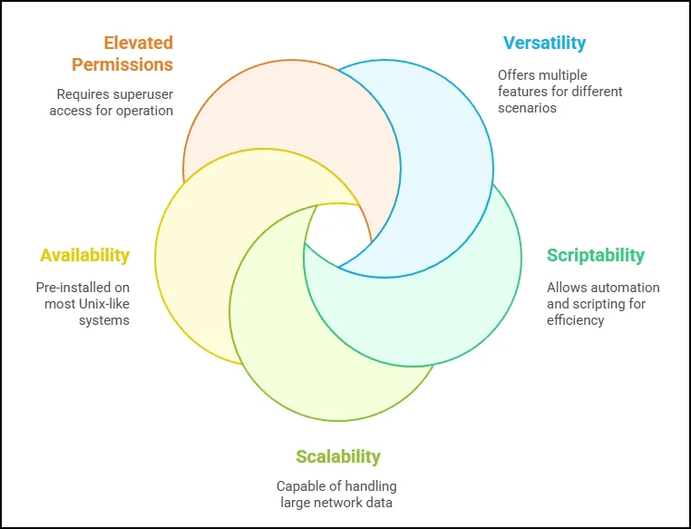

# Introduction to TCPDUMP

TCPdump is a versatile command-line packet analyzer used to capture and inspect network traffic. While offering many features available in GUI tools like Wireshark, TCPdump excels in its versatility, scriptability, and scalability, making it an essential tool for network analysts, particularly in incident response scenarios. A Windows equivalent, **WinDump**, offers similar functionality.

One of TCPdump’s key strengths lies in its widespread availability. It is typically pre-installed on most Unix-like operating systems, making it easily accessible for network professionals. Installation, if needed, is straightforward, requiring just a single command. Since TCPdump interacts directly with low-level network resources, it requires elevated permissions to operate. Running it with superuser privileges ensures authorized access to capture and analyze network traffic.



---

### **Advantages of TCPdump**

- **Command-Line Flexibility**: Allows for easy integration with scripts and automation.
- **Ubiquity**: Pre-installed on most Unix-based systems, making it widely available.
- **Resource Efficiency**: Operates without a GUI, enabling usage in headless environments.
- **Comprehensive Analysis**: Supports real-time packet capture, filtering, and saving to PCAP files for offline analysis.

---

### **Installation and Permissions**

- **Installation**: Typically pre-installed. If not, install with:
    
    ```bash
    sudo apt install tcpdump
    ```
    
- **Permissions**: Requires elevated permissions (root or superuser) to access low-level network resources:
    
    ```bash
    sudo tcpdump
    ```
    

---

### **Basic Usage**

Using TCPdump begins with a straightforward command syntax. The basic structure allows users to specify various options to tailor their captures to specific needs. For instance, users can designate a network interface, apply filters for specific IPs or ports, or save packets to a PCAP file for offline analysis. These capabilities make TCPdump a flexible tool for a range of use cases, from real-time monitoring to forensic packet inspection.

- **Command Syntax**:
    
    ```bash
    sudo tcpdump [options]
    ```
    
- **Basic Options Overview**:
    - `i [interface]`: Specifies the network interface to monitor.
    - `w [file]`: Saves captured packets to a PCAP file.
    - `r [file]`: Reads packets from a PCAP file.
    - `X`: Displays packets in both hexadecimal and ASCII.
    - `A`: Displays packet data in ASCII only.

---

### **Working with Network Interfaces**

Network interfaces play a critical role in packet capture. They act as the connection points between a system and the network, whether physical, such as Ethernet ports, or virtual, like loopback interfaces. Analysts can view available network interfaces on their system and choose which one to monitor. TCPdump even allows capturing traffic on all interfaces simultaneously, though promiscuous mode—where a network device captures all passing traffic—is unavailable in this mode. Selecting a specific interface is generally recommended for precision and efficiency.

- **Identifying Interfaces**:
    - Use `ip link show` to list system interfaces.
    - To view available capture interfaces in TCPdump:
        
        ```bash
        sudo tcpdump -D
        ```
        
- **Interface Selection**:
    - Specify an interface with `i` (e.g., `i eth0`).
    - Use `i any` to capture traffic on all interfaces, but promiscuous mode is unavailable in this setting.

---

### **Packet Capture Examples**

1. **Monitoring Local Loopback**:
    
    ```bash
    sudo tcpdump -i lo
    ```
    
    Captures traffic on the loopback interface (e.g., 127.0.0.1).
    
2. **Saving to a PCAP File**:
    
    ```bash
    sudo tcpdump -i eth0 -w capture.pcap
    ```
    
    Saves packets for later analysis with tools like Wireshark.
    
3. **Filtering Traffic**:
    - Capture traffic from a specific IP:
        
        ```bash
        sudo tcpdump -i eth0 host 192.168.223.128
        ```
        
    - Capture packets on a specific port:
        
        ```bash
        sudo tcpdump -i eth0 port 80
        ```
        

---

### **Analyzing Captured Data**

TCPdump is particularly valuable for its ability to filter and analyze captured traffic in real-time. For instance, it can isolate traffic from a specific IP address, focus on packets for a particular port, or display data in human-readable formats. Using the `-X` option, TCPdump reveals packet data in both hexadecimal and ASCII, allowing analysts to decode unencrypted payloads. Alternatively, the `-A` option focuses solely on ASCII output, which is especially useful for analyzing HTTP requests and responses. In practical scenarios, analysts might simulate network activity by running a local HTTP server, sending requests with tools like `curl`, and observing the captured traffic in TCPdump. This approach provides insights into packet content, headers, and responses, offering a comprehensive view of network interactions.

- **Real-Time Decoding**:
    - Use `X` to view packets in hexadecimal and ASCII formats:
        
        ```bash
        sudo tcpdump -i eth0 -X
        ```
        
    - Use `A` for ASCII-only output:
        
        ```bash
        sudo tcpdump -i eth0 -A
        ```
        
- **HTTP Traffic Example**:
    - Start a local HTTP server:
        
        ```bash
        sudo python3 -m http.server 80
        ```
        
    - Send a GET request with `curl`:
        
        ```bash
        curl http://127.0.0.1/fake.html
        
        ```
        
    - View detailed headers and response data in TCPdump.

---

### **Understanding TCP Handshakes**

One of TCPdump’s standout features is its ability to capture the details of TCP connections, including the three-way handshake. This handshake, which involves SYN, SYN-ACK, and ACK packets, establishes reliable communication between devices. By examining captured packets, analysts can view TCP flags, sequence numbers, and payload details, gaining a deep understanding of the underlying processes.

- Captures include details of the TCP three-way handshake:
    - **SYN** (synchronization).
    - **SYN-ACK** (synchronization acknowledgment).
    - **ACK** (acknowledgment).
- Analyze flags, sequence numbers, and payload data in captured packets.

---

### **Automating with TCPdump**

Beyond manual operation, TCPdump can be seamlessly integrated into automated workflows. Scripts can trigger packet captures during specific events or at scheduled times, making it ideal for ongoing monitoring or responding to predefined network conditions. Captured packets can be saved in PCAP files for later analysis with tools like Wireshark, offering additional flexibility.

- Schedule automated captures during specific events or times.
- Integrate with scripts to trigger packet captures based on network events.

---

### **Conclusion**

TCPdump is a powerful tool for network packet analysis, ideal for real-time monitoring, troubleshooting, and incident response. Upcoming lessons will focus on advanced filtering techniques and leveraging TCPdump’s full capabilities.

# **TCPdump Cheat Sheet**

### **Basic Command Structure**

```bash
sudo tcpdump [options] [filters]
```

---

### **Common Options**

- **Specify Network Interface**:
    
    ```bash
    -i [interface]
    ```
    
    Example: Capture traffic on `eth0`:
    
    ```bash
    sudo tcpdump -i eth0
    ```
    
- **List Available Interfaces**:
    
    ```bash
    -D
    ```
    
    Example:
    
    ```bash
    sudo tcpdump -D
    ```
    
- **Write Captured Packets to a File**:
    
    ```bash
    -w [file.pcap]
    ```
    
    Example: Save packets to `capture.pcap`:
    
    ```bash
    sudo tcpdump -i eth0 -w capture.pcap
    ```
    
- **Read Packets from a PCAP File**:
    
    ```bash
    -r [file.pcap]
    ```
    
    Example: Read packets from `capture.pcap`:
    
    ```bash
    sudo tcpdump -r capture.pcap
    ```
    
- **Display Packet Data in ASCII**:
    
    ```bash
    -A
    ```
    
    Example: View HTTP traffic payloads:
    
    ```bash
    sudo tcpdump -i eth0 -A
    ```
    
- **Display Packet Data in Hexadecimal and ASCII**:
    
    ```bash
    -X
    ```
    
    Example:
    
    ```bash
    sudo tcpdump -i eth0 -X 
    ```
    
- **Limit Number of Captured Packets**:
    
    ```bash
    -c [count]
    ```
    
    Example: Capture 10 packets:
    
    ```bash
    sudo tcpdump -i eth0 -c 10
    ```
    
- **Add Timestamps to Output**:
    
    ```bash
    -tttt
    ```
    
    Example: Detailed timestamps for each packet:
    
    ```bash
    sudo tcpdump -i eth0 -tttt
    ```
    
- **Verbose Output**:
    
    ```bash
    -v, -vv, -vvv
    ```
    
    Example: Show detailed packet information:
    
    ```bash
    sudo tcpdump -i eth0 -vv
    ```
    

---

### **Filtering Traffic**

- **Filter by Host**:
    
    ```bash
    host [IP or hostname]
    ```
    
    Example: Capture traffic from/to `192.168.1.1`:
    
    ```bash
    sudo tcpdump -i eth0 host 192.168.1.1
    ```
    
- **Filter by Source IP**:
    
    ```bash
    src [IP]
    ```
    
    Example: Capture packets from `192.168.1.1`:
    
    ```bash
    sudo tcpdump -i eth0 src 192.168.1.1
    ```
    
- **Filter by Destination IP**:
    
    ```bash
    dst [IP]
    ```
    
    Example: Capture packets to `192.168.1.1`:
    
    ```bash
    sudo tcpdump -i eth0 dst 192.168.1.1
    ```
    
- **Filter by Port**:
    
    ```bash
    port [port]
    ```
    
    Example: Capture HTTP traffic (port 80):
    
    ```bash
    sudo tcpdump -i eth0 port 80
    ```
    
- **Filter by Protocol**:
    
    ```bash
    [protocol]
    ```
    
    Example: Capture TCP traffic:
    
    ```bash
    sudo tcpdump -i eth0 tcp
    ```
    
- **Combine Filters**:
    
    ```bash
    [filter1] and|or|not [filter2]
    ```
    
    Example: Capture traffic from `192.168.1.1` on port 80:
    
    ```bash
    sudo tcpdump -i eth0 src 192.168.1.1 and port 80
    ```
    

---

### **Advanced Usage**

- **Capture Specific Packet Size**:
    
    ```bash
    -s [snaplen]
    ```
    
    Example: Capture the first 100 bytes of each packet:
    
    ```bash
    sudo tcpdump -i eth0 -s 100
    ```
    
- **Monitor All Interfaces**:
    
    ```bash
    -i any
    ```
    
    Example: Capture traffic across all interfaces:
    
    ```bash
    sudo tcpdump -i any
    ```
    
- **Capture Only Headers**:
    
    ```bash
    -s 0
    ```
    
    Example: Capture headers without payload:
    
    ```bash
    sudo tcpdump -i eth0 -s 0
    ```
    
- **Filter by TCP Flags**:
    
    ```bash
    tcp[tcpflags] & [flag] != 0
    ```
    
    Example: Capture SYN packets:
    
    ```bash
    sudo tcpdump 'tcp[tcpflags] & tcp-syn != 0'
    ```
    

---

### **Quick Examples**

- **Capture ICMP (ping) traffic**:
    
    ```bash
    sudo tcpdump -i eth0 icmp
    ```
    
- **Capture traffic on a specific subnet**:
    
    ```bash
    sudo tcpdump net 192.168.1.0/24
    ```
    
- **Capture traffic excluding a specific host**:
    
    ```bash
    sudo tcpdump -i eth0 not host 192.168.1.1
    ```
    
- **Capture packets with a specific payload**:
    
    ```bash
    sudo tcpdump -A -i eth0 'tcp contains "GET"'
    ```
    
- **View all DNS queries**:
    
    ```bash
    sudo tcpdump -i eth0 port 53
    ```