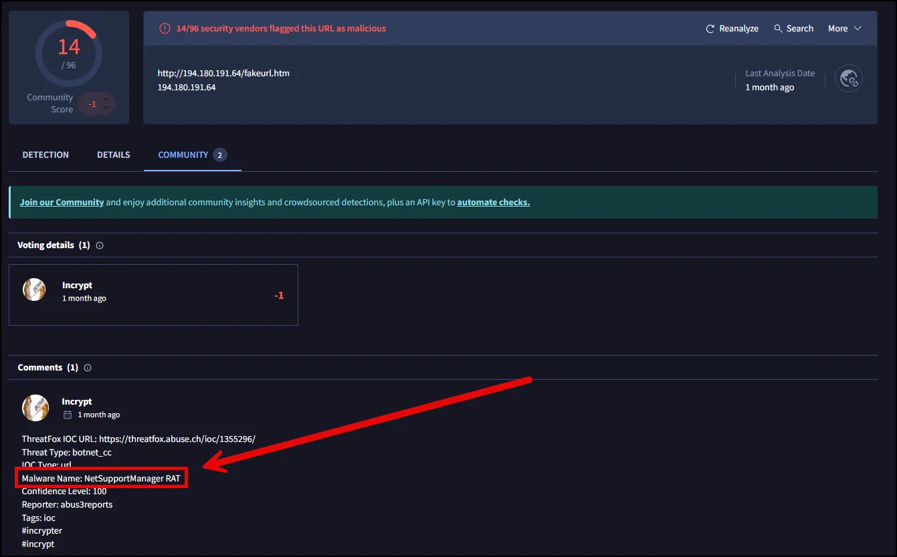

# Analyze Network Traffic with TCPdump

Now that we understand how to capture and filter network traffic with TCPdump, it's time to apply those skills in a practical analysis using a real-world PCAP file. This file originates from a system involved in malware campaigns, providing valuable insight into malicious activity. The pcap can be downloaded from Malware Traffic Analysis found at the link below.

[Malware-Traffic-Analysis.net - 2024-11-26 - Traffic analysis exercise: Nemotodes](https://malware-traffic-analysis.net/2024/11/26/index.html)

### **Analyzing a Real-World PCAP**

We’ll analyze the file 2024-11-26-traffic-analysis-exercise.pcap, which contains traffic from a host infected with NetSupport RAT, a known remote access Trojan. 

The following alerts for NetSupportRAT were triggered:


Our analysis will follow a structured approach:

1. Start with a high-level overview to identify interesting patterns or conversations.
2. Narrow the scope to specific IP addresses or protocols.
3. Use filters to uncover Indicators of Compromise (IOCs).

To begin, display all packets in the file:

To view the contents of a PCAP file with TCPdump, navigate to where the file was downloaded and unzipped and use the `-r` option to read the file:

```bash
sudo tcpdump -r 2024-11-26-traffic-analysis-exercise.pcap
```


1. **Count Packets**:
The `--count` option displays the total number of packets matching a filter. Without a filter, it counts all packets in the PCAP.
    
    ```bash
    sudo tcpdump -r 2024-11-26-traffic-analysis-exercise.pcap --count
    ```
    
    Example: Determine the total packet count in a file.
    
    
    
2. **Timestamp Modifiers**:
Timestamps are essential for packet analysis. TCPdump offers multiple timestamp formats:
    - `t`: Suppresses timestamps.
    - `tt`: Converts timestamps to UNIX epoch time.
    - `ttt`: Displays the time difference (delta) between packets.
    - `tttt`: Prints timestamps in a detailed human-readable format (YYYY-MM-DD HH:MM:SS).

This file contains approximately 26,922 packets. To simplify timestamp tracking, convert them to standard time format using `-tttt`:

```bash
tcpdump -tttt -r 2024-11-26-traffic-analysis-exercise.pcap
```


---

### **Filtering Traffic**

1. **Add Source IP Filtering**:
Based on the alerts we can surmise that 10.11.26.183 is the infected host. Filter packets where this IP and 194.180.191.64 is involved and check the count of packets.
    
    ```bash
    tcpdump -r 2024-11-26-traffic-analysis-exercise.pcap host 10.11.26.183 and host 194.180.191.64 -tttt --count
    ```
    

As seen below, we narrowed it down to 132 packets.


Add the -n flag to prevent the TCPdump from resolving IP addresses to hostnames, speeding up the capture and keeping the output in raw IP format..

```jsx
tcpdump -n -r 2024-11-26-traffic-analysis-exercise.pcap host 10.11.26.183 and host 194.180.191.64 -tttt 
```

As seen below we confirm the traffic between 10.11.26.183 and 194[.]180[.]191[.]64.


The following command reveals a suspicious user agent string.

```jsx
tcpdump -n -A -tttt -r 2024-11-26-traffic-analysis-exercise.pcap host 10.11.26.183 and host 194.180.191.64 
```


The NetSupport service is known to be widely abused and used in NetSupportRAT. If your organization does not use this service, this is almost certainly malicious activity.

**Search for Specific HTTP Requests**:
Use `grep` to find GET and POST requests, which may indicate interactions with web resources. Be sure to use the -A flag to filter for ASCII characters.

```bash
tcpdump -n -A -r 2024-11-26-traffic-analysis-exercise.pcap host 10.11.26.183 and host 194.180.191.64 -tttt | grep -E "GET|POST"

```

As seen below, we see multiple POST requests to 194[.]180[.]191[.]64/fakeurl[.]htm


---

Pivoting to open source research, using VirusTotal, we confirm that 194[.]180[.]191[.]64/fakeurl[.]htm is associated with NetSupportRAT malicous activity.




### Discover the victim’s name

Using the following command we can grep for the victim by searching for LDAP field “givenName”.

```jsx
tcpdump -n -A -r 2024-11-26-traffic-analysis-exercise.pcap host 10.11.26.183 | grep -E -i "givenName"
```

As seen below, the victim is Oliver Boomwald.


**Important Notes**

1. **If Traffic Is Encrypted**:
    - This command will not display `givenName` because encrypted traffic hides payload data. Only plaintext protocols, like LDAP on port 389, will work.
2. **For Better Analysis**:
    - If the data isn't easily readable in `tcpdump`, consider saving the filtered packets to a PCAP file and analyzing them in **Wireshark**.

### Digging Deeper for the Root Cause

Using the command below we can see DNS requests for A records to see what domains may have been visited before the callout to the NetSupportRAT C2.

```jsx
tcpdump -n -A -tttt -r 2024-11-26-traffic-analysis-exercise.pcap host 10.11.26.183 and udp and port 53 | grep -E " A"
```


As seen above **classicgrand[.]com** was likely visited, because there was a DNS request for it, at . 2024-11-26 23:50:11. The first call out to the C2 was at 2024-11-26 23:50:45, 34 seconds after visiting classicgrand[.]com. 

Brad Duncan (owner of Malware Traffic Analysis) visited  [classicgrand](http://classicgrand.com)[.com] shortly after the event and was able to generate an infection from a fake browser update named update.js.

.


Source: Malware Traffic Analysis

 Note the address for the short cut button “Update Edge” is modandcrackedapk[.]com.

Pivoting back to VirusTotal, we can see that modandcrackedapk[.]com is almost certainly malicious.


### Conclusion

We have demonstrated that TCPdump can be used to analyze pcap files, as well as capture them. However, it does take some knowledge of the CLI and options to analyze the traffic. In future lessons we will demonstrate that Wireshark is perhaps more efficient for packet analysis.

If you want to practice more, the Malware Traffic Analysis website has multiple real-world pcap exercises. 

[Malware-Traffic-Analysis.net - training exercises](https://malware-traffic-analysis.net/training-exercises.html)