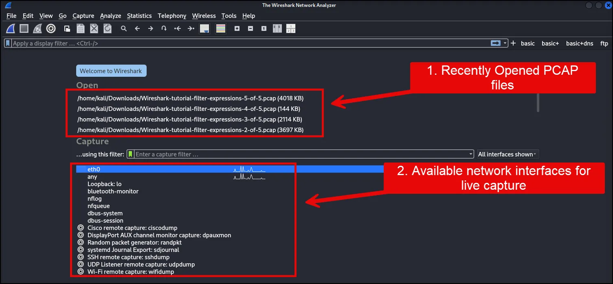
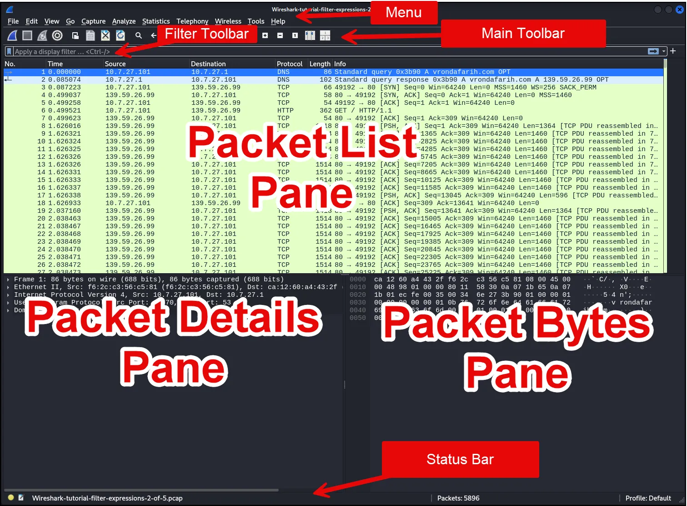
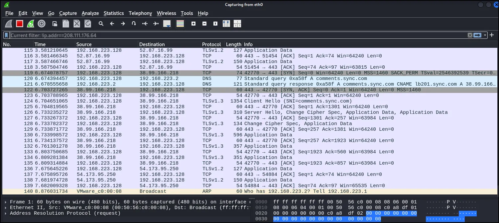
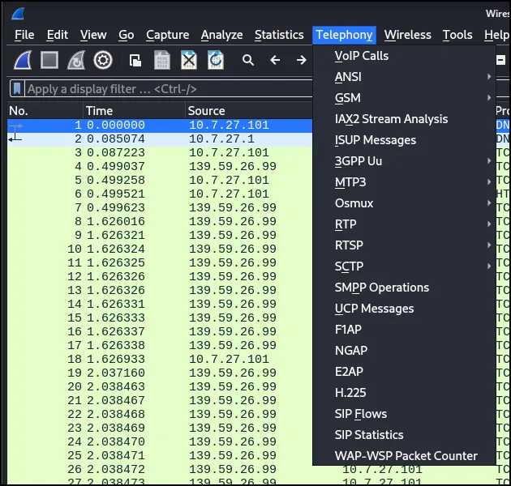
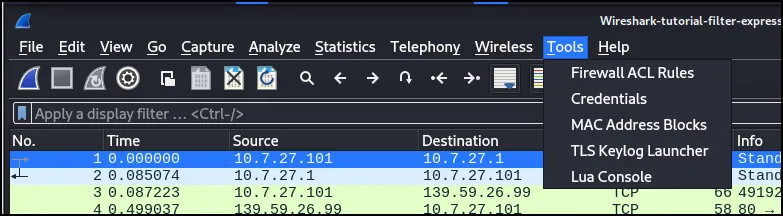

# Wireshark Part 1: Intoduction to Wireshark

Wireshark is a free, open-source, graphical network protocol analyzer and is one of the most widely used tools of its kind. Like TCPdump, Wireshark supports live and offline traffic analysis. It can capture live network traffic from any available network interface or analyze previously saved packet captures. However, as a GUI-based tool, Wireshark provides several advantages over TCPdump, including detailed protocol inspection, powerful display filters to isolate specific traffic, and the ability to follow conversations like TCP or HTTP data streams. Additionally, Wireshark offers high-level statistics, making the initial analysis process more efficient.

When comparing Wireshark and TCPdump, neither tool is strictly better—they each have unique strengths. TCPdump, a command-line tool, is highly efficient for environments with high-speed traffic and large volumes of data. It is lightweight, available on nearly all Unix-based systems, and can operate without a graphical interface, making it ideal for remote or headless systems. Wireshark, on the other hand, excels at detailed packet inspection, offering intuitive filtering, visualization, and statistical tools. However, Wireshark can struggle with very large PCAP files and may require filtering the data using tools like TCPdump or TShark before analysis.

### **Installing Wireshark**

Unlike TCPdump, Wireshark does not typically come pre-installed on Linux distributions or Windows systems. Here’s how to install it:

1. **On Linux (e.g., Ubuntu):**
    - Use the package manager to install Wireshark:
        
        ```bash
        sudo apt install wireshark
        
        ```
        
    - During installation, you’ll be prompted to decide if non-root users should have permission to capture packets. By default, this is disabled, meaning you’ll need to run Wireshark with elevated privileges (e.g., `sudo`) to capture traffic.
    - 
2. **On Windows:**
    - Download the installer from [Wireshark.org](https://www.wireshark.org/).
    - Run the installer and follow the setup wizard.
    - Include optional components, such as TShark (the command-line version of Wireshark) and Npcap (required for packet capturing).

Once installed, you can launch Wireshark and begin analyzing network traffic. On Linux systems, ensure you use `sudo` if non-root users cannot capture packets.

---

### **Getting Started with Wireshark**

When you open Wireshark, you’ll see a welcome screen listing:

1. Recently opened PCAP files.
2. Available network interfaces for live capture.

At the top, the toolbar provides access to common actions such as starting/stopping a capture, restarting it, or opening files. Below, the interface list shows available network interfaces, including activity indicators (e.g., graphs of live traffic). You can select a single interface or multiple interfaces for capturing traffic.



For demonstration purposes, I’ll open one of the previous pcap files.



Wireshark's main window is organized into several familiar components found in many graphical user interface (GUI) programs:

1. **Menu**: Provides access to actions and features of the program (see *The Menu in the Appendix for more details*).
2. **Main Toolbar**: Offers quick access to commonly used functions from the menu (see *The “Main” Toolbar in the Appendix for more details*).
3. **Filter Toolbar**: Allows users to apply display filters, controlling which packets are visible (see *Filtering Packets While Viewing in the Appendix for more details*).
4. **Packet List Pane**: Displays a summary of all captured packets. Selecting a packet here updates the content displayed in the other panes (see *The “Packet List” Pane in the Appendix for more details*).
5. **Packet Details Pane**: Shows a detailed breakdown of the selected packet, organized by protocol layers (see *The “Packet Details” Pane in the Appendix for more details*).
6. **Packet Bytes Pane**: Displays the raw data of the selected packet, highlighting the specific field chosen in the details pane (see *The “Packet Bytes” Pane in the Appendix for more details*).
7. **Status Bar**: Displays detailed information about the current program state and the captured data (see *The Statusbar in the Appendix for more details*).

This structure provides a logical and intuitive workflow for packet analysis.

## Capture Packets

Once you’ve installed Wireshark, you can start grabbing network traffic. But remember: To capture any packets, you need to have proper permissions on your computer to put Wireshark into promiscuous mode.

- In a Windows system, this usually means you have administrator access.
- In a Linux system, it usually means that you have root access.

As long as you have the right permissions, you have several options to actually start the capture. Perhaps the best is to select Capture >> Options from the main window. This will bring up the Capture Interfaces window, as shown below.


This window will list all available interfaces. In this case, Wireshark provides several to choose from.

For this example, we’ll select the eth0 interface, which is the most active interface. Wireshark visualizes the traffic by showing a moving line, which represents the packets on the network.

Once the network interface is selected, you simply click the Start button to begin your capture. As the capture begins, it’s possible to view the packets that appear on the screen, as shown below.



Once you have captured all the packets that you want, simply click the red, square button at the top. Now you have a static packet capture to investigate.


## **How to Filter and Inspect Packets in Wireshark**

You can apply Wireshark filters in two ways:

1. In the Display Filter window, at the top of the screen

1. By highlighting a packet (or a portion of a packet) and right-clicking on the packet

Wireshark filters use key phrases, such as the following:


You can also use the following values:


Valid filter rules are always colored green. If you make a mistake on a filter rule, the box will turn red.


Let’s start with a couple of basic rules. For example, let’s say you want to see packets that have only the IP address of 10.7.27.101 somewhere inside. You would create the following command line, and put it into the Filter window.

```jsx
ip.addr==10.7.27.101
```


Alternatively, you can highlight the IP address of a packet and then create a filter for it. Once you select the IP address, right-click, and then select the Apply As Filter option. You’ll then see a menu of additional options. One of those is called Selected. If you choose Selected, then Wireshark will create a filter that shows only packets with that IP address in it


You can also decide to filter out a specific IP address using the following filter, shown below.

```jsx
!ip.addr==208.111.176.64
```


Additional filters include:


# Appendix

### The Menu


The main menu contains the following items:

**File**

This menu contains items to open and merge capture files, save, print, or export capture files in whole or in part, and to quit the Wireshark application. 


| **Menu Item** | **Accelerator** | **Description** |
| --- | --- | --- |
| **Open…** | Ctrl + O | This shows the file open dialog box that allows you to load a capture file for viewing. It is discussed in more detail in [The “Open Capture]() [File” Dialog Box](). |
| **Open Recent** |  | This lets you open recently opened capture files. Clicking on one of the submenu items will open the corresponding capture file directly. |
| **Merge…** |  | This menu item lets you merge a capture file into the currently loaded one. It is discussed in more detail in [Merging Capture Files](). |
| **Import from Hex Dump…** |  | This menu item brings up the import file dialog box that allows you to import a text file containing a hex dump into a new temporary capture. It is discussed in more detail in [Import]() [Hex Dump](). |
| **Close** | Ctrl + W | This menu item closes the current capture. If you haven’t saved the capture, you will be asked to do so first (this can be disabled by a preference setting). |
| **Save** | Ctrl + S | This menu item saves the current capture. If you have not set a default capture file name (perhaps with the -w <capfile> option), Wireshark pops up the Save Capture File As dialog box (which is discussed further in [The]() [“Save Capture File As” Dialog Box]()).
 **
If you have already saved the current capture, this menu item will be greyed out.
 **
You cannot save a live capture while the capture is in progress. You must stop the capture in order to save. |
| **Save As…** | Shift + Ctrl + S | This menu item allows you to save the current capture file to whatever file you would like. It pops up the Save Capture File As dialog box (which is discussed further in [The “Save Capture]() [File As” Dialog Box]()). |

**Edit**

This menu contains items to find a packet, time reference or mark one or more packets, handle configuration profiles, and set your preference. 


| **Menu Item** | **Accelerator** | **Description** |
| --- | --- | --- |
| **Copy** |  | These menu items will copy the packet list, packet detail, or properties of the currently selected packet to the clipboard. |
| **Find Packet…** | Ctrl + F | This menu item brings up a toolbar that allows you to find a packet by many criteria. There is further information on finding packets in [Finding Packets](). |
| **Find Next** | Ctrl + N | This menu item tries to find the next packet matching the settings from “Find Packet…”. |
| **Find Previous** | Ctrl + B | This menu item tries to find the previous packet matching the settings from “Find Packet…”. |
| **Mark/Unmark Selected** | Ctrl + M | This menu item marks the currently selected packet. See [Marking Packets]() for details. |
| **Mark All Displayed Packets** | Ctrl + Shift + M | This menu item marks all displayed packets. |
| **Unmark All Displayed Packets** | Ctrl + Alt + M | This menu item unmarks all displayed packets. |
| **Next Mark** | Ctrl + Shift + N | Find the next marked packet. |

**View**

This menu controls the display of the captured data, including colorization of packets, zooming the font, showing a packet in a separate window, expanding and collapsing trees in packet details.


| **Menu Item** | **Accelerator** | **Description** |
| --- | --- | --- |
| **Main Toolbar** |  | This menu item hides or shows the main toolbar, see [The “Main” Toolbar](). |
| **Filter Toolbar** |  | This menu item hides or shows the filter toolbar, see [The “Filter” Toolbar](). |
| **Wireless Toolbar** |  | This menu item hides or shows the wireless toolbar. May not be present on some platforms. |
| **Statusbar** |  | This menu item hides or shows the statusbar, see [The Statusbar](). |
| **Packet List** |  | This menu item hides or shows the packet list pane, see [The “Packet List” Pane](). |
| **Packet Details** |  | This menu item hides or shows the packet details pane, see [The “Packet Details” Pane](). |
| **Packet Bytes** |  | This menu item hides or shows the packet bytes pane, see [The “Packet Bytes” Pane](). |
| **Packet Diagram** |  | This menu item hides or shows the packet diagram pane. See [The “Packet Diagram” Pane](). |
| **Time Display Format › Date and Time of Day: 1970-01-01 01:02:03.123456** |  | Selecting this tells Wireshark to display the time stamps in date and time of day format, see [Time]() [Display Formats And Time References]().
 **
The fields “Time of Day”, “Date and Time of Day”, “Seconds Since First Captured Packet”, “Seconds Since Previous Captured Packet” and “Seconds Since Previous Displayed Packet” are mutually exclusive. |
| **Time Display Format › Time of Day: 01:02:03.123456** |  | Selecting this tells Wireshark to display time stamps in time of day format, see [Time Display]() [Formats And Time References](). |
| **Time Display Format › Seconds Since Epoch (1970- 01-01): 1234567890.123456** |  | Selecting this tells Wireshark to display time stamps in seconds since 1970-01-01 00:00:00, see [Time Display Formats And Time References](). |
| **Time Display Format › Seconds Since First Captured Packet: 123.123456** |  | Selecting this tells Wireshark to display time stamps in seconds since first captured packet format, see [Time Display Formats And Time]() [References](). |

| **Menu Item** | **Accelerator** | **Description** |
| --- | --- | --- |
| **Time Display Format › Seconds Since Previous Captured Packet: 1.123456** |  | Selecting this tells Wireshark to display time stamps in seconds since previous captured packet format, see [Time Display Formats And]() [Time References](). |
| **Time Display Format › Seconds Since Previous Displayed Packet: 1.123456** |  | Selecting this tells Wireshark to display time stamps in seconds since previous displayed packet format, see [Time Display Formats And]() [Time References](). |
| **Time Display Format › Automatic (File Format Precision)** |  | Selecting this tells Wireshark to display time stamps with the precision given by the capture file format used, see [Time Display Formats And]() [Time References]().
 **
The fields “Automatic”, “Seconds” and “… seconds” are mutually exclusive. |
| **Time Display Format ›**
**Seconds: 0** |  | Selecting this tells Wireshark to display time stamps with a precision of one second, see [Time]() [Display Formats And Time References](). |
| **Time Display Format › … seconds: 0….** |  | Selecting this tells Wireshark to display time stamps with a precision of one second, decisecond, centisecond, millisecond, microsecond or nanosecond, see [Time Display]() [Formats And Time References](). |
| **Time Display Format › Display Seconds with hours and minutes** |  | Selecting this tells Wireshark to display time stamps in seconds, with hours and minutes. |
| **Name Resolution › Edit Resolved Name** |  | This item allows you to manually enter names to resolve IP addresses in the current packet, see [Name Resolution](). |
| **Name Resolution › Enable for MAC Layer** |  | This item allows you to control whether or not Wireshark translates MAC addresses into names, see [Name Resolution](). |
| **Name Resolution › Enable for Network Layer** |  | This item allows you to control whether or not Wireshark translates network addresses into names, see [Name Resolution](). |
| **Name Resolution › Enable for Transport Layer** |  | This item allows you to control whether or not Wireshark translates transport addresses into names, see [Name Resolution](). |

| **Menu Item** | **Accelerator** | **Description** |
| --- | --- | --- |
| **Zoom In** | Ctrl + + | Zoom into the packet data (increase the font size). |
| **Zoom Out** | Ctrl + - | Zoom out of the packet data (decrease the font size). |
| **Normal Size** | Ctrl + = | Set zoom level back to 100% (set font size back to normal). |
| **Expand Subtrees** | Shift + → | This menu item expands the currently selected subtree in the packet details tree. |
| **Collapse Subtrees** | Shift + ← | This menu item collapses the currently selected subtree in the packet details tree. |
| **Expand All** | Ctrl + → | Wireshark keeps a list of all the protocol subtrees that are expanded, and uses it to ensure that the correct subtrees are expanded when you display a packet. This menu item expands all subtrees in all packets in the capture. |
| **Collapse All** | Ctrl + ← | This menu item collapses the tree view of all packets in the capture list. |
| **Colorize Packet List** |  | This item allows you to control whether or not Wireshark should colorize the packet list.
 **
Enabling colorization will slow down the display of new packets while capturing or loading capture files. |
| **Colorize Conversation** |  | This menu item brings up a submenu that allows you to color packets in the packet list pane based on the addresses of the currently selected packet. This makes it easy to distinguish packets belonging to different conversations. [Packet]() [colorization](). |
| **Colorize Conversation ›**
**Color 1-10** |  | These menu items enable one of the ten temporary color filters based on the currently selected conversation. |
| **Colorize Conversation ›**
**Reset coloring** |  | This menu item clears all temporary coloring rules. |
| **Colorize Conversation ›**
**New Coloring Rule…** |  | This menu item opens a dialog window in which a new permanent coloring rule can be created based on the currently selected conversation. |

| **Menu Item** | **Accelerator** | **Description** |
| --- | --- | --- |
| **Coloring Rules…** |  | This menu item brings up a dialog box that allows you to color packets in the packet list pane according to filter expressions you choose. It can be very useful for spotting certain types of packets, see [Packet colorization](). |
| **Resize All Columns** | Shift + Ctrl + R | Resize all column widths so the content will fit into it.
 **
Resizing may take a significant amount of time, especially if a large capture file is loaded. |
| **Internals** |  | Information about various internal data structures. See [Internals menu items]() below for more information. |
| **Show Packet in New Window** |  | Shows the selected packet in a separate window. The separate window shows only the packet details and bytes of that packet, and will continue to do so even if another packet is selected in the main window. See [Viewing a]() [packet in a separate window]() for details. |
| **Reload** | Ctrl + R | This menu item allows you to reload the current capture file. |

**Go**

This menu contains items to go to a specific packet. 


| **Menu Item** | **Accelerator** | **Description** |
| --- | --- | --- |
| **Back** | Alt + ← | Jump to the recently visited packet in the packet history, much like the page history in a web browser. |
| **Forward** | Alt + → | Jump to the next visited packet in the packet history, much like the page history in a web browser. |
| **Go to Packet…** | Ctrl + G | Bring up a window frame that allows you to specify a packet number, and then goes to that packet. See [Go To A Specific Packet]() for details. |
| **Go to Corresponding Packet** |  | Go to the corresponding packet of the currently selected protocol field (e.g., the reply corresponding to a request packet, or vice versa). If the selected field doesn’t correspond to a packet, this item is greyed out. |
| **Previous Packet** | Ctrl + ↑ | Move to the previous packet in the list. This can be used to move to the previous packet even if the packet list doesn’t have keyboard focus. |

| **Menu Item** | **Accelerator** | **Description** |
| --- | --- | --- |
| **Next Packet** | Ctrl + ↓ | Move to the next packet in the list. This can be used to move to the previous packet even if the packet list doesn’t have keyboard focus. |
| **First Packet** | Ctrl + Home | Jump to the first packet of the capture file. |
| **Last Packet** | Ctrl + End | Jump to the last packet of the capture file. |
| **Previous Packet In Conversation** | Ctrl + , | Move to the previous packet in the current conversation. This can be used to move to the previous packet even if the packet list doesn’t have keyboard focus. |
| **Next Packet In Conversation** | Ctrl + . | Move to the next packet in the current conversation. This can be used to move to the previous packet even if the packet list doesn’t have keyboard focus. |
| **Auto Scroll in Live Capture** |  | This item allows you to specify that Wireshark should scroll the packet list pane as new packets come in, so you are always looking at the last packet. If you do not specify this, Wireshark simply adds new packets onto the end of the list, but does not scroll the packet list pane. |

**Capture**

This menu allows you to start and stop captures and to edit capture filters. See [The “Capture”]() [Menu]().


| **Menu Item** | **Accelerator** | **Description** |
| --- | --- | --- |
| **Options…** | Ctrl + K | Shows the Capture Options dialog box, which allows you to configure interfaces and capture options. See [The “Capture Options” Dialog Box](). |
| **Start** | Ctrl + E | Immediately starts capturing packets with the same settings as the last time. |
| **Stop** | Ctrl + E | Stops the currently running capture. See [Stop]() [the running capture](). |
| **Restart** | Ctrl + R | Stops the currently running capture and starts it again with the same options. |
| **Capture Filters…** |  | Shows a dialog box that allows you to create and edit capture filters. You can name filters and save them for future use. See [Defining And]() [Saving Filters](). |
| **Refresh Interfaces** | F5 | Clear and recreate the interface list. |

**Analyze**

This menu contains items to manipulate display filters, enable or disable the dissection of protocols, configure user specified decodes and follow a TCP stream. 


| **Menu Item** | **Accelerator** | **Description** |
| --- | --- | --- |
| **Display Filters…** |  | Displays a dialog box that allows you to create and edit display filters. You can name filters, and you can save them for future use. See [Defining]() [And Saving Filters](). |
| **Display Filter Macros…** |  | Shows a dialog box that allows you to create and edit display filter macros. You can name filter macros, and you can save them for future use.
See [Defining And Saving Filter Macros](). |
| **Display Filter Expression…** |  | Shows a dialog box that allows you to build a display filter expression to apply. This shows possible fields and their applicable relations and values, and allows you to search by name and description. See [The “Display Filter Expression”]() [Dialog Box](). |

| **Menu Item** | **Accelerator** | **Description** |
| --- | --- | --- |
| **Apply as Column** | Shift + Ctrl + I | Adds the selected protocol item in the packet details pane as a column to the packet list. |
| **Apply as Filter** |  | Change the current display filter and apply it immediately. Depending on the chosen menu item, the current display filter string will be replaced or appended to by the selected protocol field in the packet details pane. |
| **Prepare as Filter** |  | Change the current display filter but won’t apply it. Depending on the chosen menu item, the current display filter string will be replaced or appended to by the selected protocol field in the packet details pane. |
| **Conversation Filter** |  | Apply a conversation filter for various protocols. |
| **Enabled Protocols…** | Shift + Ctrl + E | Enable or disable various protocol dissectors. See [The “Enabled Protocols” dialog box](). |
| **Decode As…** |  | Decode certain packets as a particular protocol. See [User Specified Decodes](). |
| **SCTP** |  | Allows you to analyze and prepare a filter for this SCTP association. See [SCTP Windows](). |
| **Follow** |  | Opens a sub-menu with options of various types of protocol streams to follow. The entries for protocols which aren’t found in the currently selected packet will be disabled. See    [Following]() [Protocol Streams](). |
| **Show Packet Bytes** |  | Open a window allowing for decoding and reformatting packet bytes. You can do actions like Base64 decode, decompress, interpret as a different character encoding, interpret bytes as an image format, and save, print, or copy to the clipboard the results. See [Show Packet Bytes]() for more information. |

| **Menu Item** | **Accelerator** | **Description** |
| --- | --- | --- |
| **Expert Info** |  | Open a window showing expert information found in the capture. Some protocol dissectors add packet detail items for notable or unusual behavior, such as invalid checksums or retransmissions. Those items are shown here. See [Expert Information]() for more information.
 **
The amount of information will vary depend on the protocol |

**Statistics**

This menu contains items to display various statistic windows, including a summary of the packets that have been captured, display protocol hierarchy statistics and much more. 


| **Menu Item** | **Accelerator** | **Description** |
| --- | --- | --- |
| **Capture File Properties** |  | Show information about the capture file. |

| **Menu Item** | **Accelerator** | **Description** |
| --- | --- | --- |
| **Resolved Addresses** |  | The Resolved Addresses window shows the list of resolved addresses and their host names. Users can choose the Hosts field to display IPv4 and IPv6 addresses only. In this case, the dialog displays host names for each IP address in a capture file with a known host. This host is typically taken from DNS answers in a capture file. In case of an unknown host name, users can populate it based on a reverse DNS lookup |
| **Protocol Hierarchy** |  | Display a hierarchical tree of protocol statistics. |
| **Conversations** |  | Display a list of conversations (traffic between two endpoints). |
| **Endpoints** |  | Display a list of endpoints (traffic to/from an address). |
| **Packet Lengths** |  | Shows the distribution of packet lengths and related information. |
| **I/O Graphs** |  | Display user specified graphs (e.g., the number of packets in the course of time). |
| **Service Response Time** |  | Display the time between a request and the corresponding response. |
| **DHCP (BOOTP)** |  | The Dynamic Host Configuration Protocol (DHCP) is an option of the Bootstrap Protocol (BOOTP). It dynamically assigns IP addresses and other parameters to a DHCP client. The DHCP (BOOTP) Statistics window displays a table over the number of occurrences of a DHCP message type. The user can filter, copy or save the data into a file. |
| **NetPerfMeter** |  | The NetPerfMeter Protocol (NPMP) is the control and data transfer protocol of NetPerfMeter, the transport protocol performance testing tool. It transmits data streams over TCP, SCTP, UDP and DCCP with given parameters, such as frame rate, frame size, saturated flows, etc. |
| **ONC-RPC Programs** |  | Open Network Computing (ONC) Remote Procedure Call (RPC) uses TCP or UDP protocols to map a program number to a specific port on a remote machine and call a required service at that port. The ONC-RPC Programs window shows the description for captured program calls, such as program name, its number, version, and other data. |
| **29West** |  | The 29West technology now refers to Ultra-Low Latency Messaging (ULLM) technology. It allows sending and receiving a high number of messages per second with microsecond delivery times for zero-latency data delivery. |
| **ANCP** |  | The Access Node Control Protocol (ANCP) is an TCP based protocol, which operates between an Access Node and Network Access Server.  |
| **BACnet** |  |  |
| **Collectd** |  | Collectd is a system statistics collection daemon. It collects various statistics from your system and converts it for the network use. The Collectd statistics window shows counts for values, which split into type, plugin, and host as well as total packets counter. You can filter, copy or save the data to a file. |
| **DNS** |  | The Domain Name System (DNS) associates different information, such as IP addresses, with domain names. DNS returns different codes, request-response and counters for various aggregations. The DNS statistics window enlists a total count of DNS messages, which are divided into groups by request types (opcodes), response code (rcode), query type, and others. |
| **Flow Graph** |  | The Flow Graph window shows connections between hosts. It displays the packet time, direction, ports and comments for each captured connection. You can filter all connections by ICMP Flows, ICMPv6 Flows, UIM Flows and TCP Flows. Flow Graph window is used for showing multiple different topics. Based on it, it offers different controls. |
| **HART-IP** |  | Highway Addressable Remote Transducer over IP (HART-IP) is an application layer protocol. It sends and receives digital information between smart devices and control or monitoring systems. The HART-IP statistics window shows the counter for response, request, publish and error packets. You can filter, copy or save the data to a file. |
| **HPFEEDS** |  | Hpfeeds protocol provides a lightweight authenticated publishing and subscription. It supports arbitrary binary payloads which can be separated into different channels. HPFEEDS statistics window shows a counter for payload size per channel and opcodes. You can filter, copy or save the data to a file. |
| **HTTP** |  | HTTP request/response statistics. |
| **HTTP2** |  | Hypertext Transfer Protocol version 2 (HTTP/2) allows multiplexing various HTTP requests and responses over a single connection. It uses a binary encoding which is consisting of frames. The HTTP/2 statistics window shows the total number of HTTP/2 frames and also provides a breakdown per frame types, such as HEADERS, DATA, and others. |
| **Sametime** |  | Sametime is a protocol for the IBM Sametime software. The Sametime statistics window shows the counter for message type, send type, and user status. |
| **TCP Stream Graphs** |  | Show different visual representations of the TCP streams in a capture. |
| **UDP Multicast Streams** |  | The UDP Multicast Streams window shows statistics for all UDP multicast streams. It includes source addresses and ports, destination addresses and ports, packets counter and other data. You can specify the burst interval, the alarm limits and output speeds.  |
| **Reliable Server Pooling (RSerPool)** |  | The Reliable Server Pooling (RSerPool) windows show statistics for the different protocols of Reliable Server Pooling  |

**Telephony**

This menu contains items to display various telephony related statistic windows, including a media analysis, flow diagrams, display protocol hierarchy statistics and much more. 



| **Menu Item** | **Accelerator** | **Description** |
| --- | --- | --- |
| **VoIP Calls…** |  | The VoIP Calls window shows a list of all detected VoIP calls in the captured traffic. It finds calls by their signaling and shows related RTP streams |
| **ANSI** |  | This menu shows groups of statistic data for mobile communication protocols according to ETSI GSM standards. |
| **GSM** |  | The Global System for Mobile Communications (GSM) is a standard for mobile networks. This menu shows a group of statistic data for mobile communication protocols according to ETSI GSM standard. |
| **IAX2 Stream Analysis** |  | The “IAX2 Stream Analysis” window shows statistics for the forward and reverse streams of a selected IAX2 call along with a graph |
| **ISUP Messages** |  |  |

| **Menu Item** | **Accelerator** | **Description** |
| --- | --- | --- |
| **LTE** |  | Statistics of the captured LTE or NR MAC traffic. This window will summarize the MAC traffic found in the capture. |
| **MTP3** |  | The Message Transfer Part level 3 (MTP3) protocol is a part of the Signaling System 7 (SS7). The Public Switched Telephone Networks use it for reliable, unduplicated and in-sequence transport of SS7 messaging between communication partners. |
| **Osmux** |  | OSmux is a multiplex protocol designed to reduce bandwidth usage of satellite-based GSM systems’s voice (RTP-AMR) and signaling traffic. The OSmux menu opens the packet counter window with the related statistic data. The user can filter, copy or save the data into a file. |
| **RTP** |  | The RTP streams window shows all RTP streams in capture file. Streams can be selected there and on selected streams other tools can be initiated. |
| **RTSP** |  | In the Real Time Streaming Protocol (RTSP) menu the user can check the Packet Counter window. It shows Total RTCP Packets and divided into RTSP Response Packets, RTSP Request Packets and Other RTSP packets. The user can filter, copy or save the data into a file. |
| **SCTP** |  |  |
| **SMPP Operations** |  | Short Message Peer-to-Peer (SMPP) protocol uses TCP protocol as its transfer for exchanging Short Message Service (SMS) Messages, mainly between Short Message Service Centers (SMSC). The dissector determines whether the captured packet is SMPP or not by using the heuristics in the fixed header. The SMPP Operations window displays the related statistical data. The user can filter, copy or save the data into a file. |
| **UCP Messages** |  | The Universal Computer Protocol (UCP) plays role in transferring Short Messages between a Short Message Service Centre (SMSC) and an application, which is using transport protocol, such as TCP or X.25. The UCP Messages window displays the related statistical data. The user can filter, copy or save the data into a file. |
| **H.225** |  | H.225 telecommunication protocol which is responsible for messages in call signaling and media stream packetization for packet-based multimedia communication systems. The H.225 window shows the counted messages by types and reasons. The user can filter, copy or save the data into a file. |
| **SIP Flows** |  | Session Initiation Protocol (SIP) Flows window shows the list of all captured SIP transactions, such as client registrations, messages, calls and so on. |
| **SIP Statistics** |  | SIP Statistics window shows captured SIP transactions. It is divided into SIP Responses and SIP Requests. In this window the user can filter, copy or save the statistics into a file. |
| **WAP-WSP Packet Counter** |  | The WAP-WSP Packet Counter menu displays the number of packets for each Status Code and PDU Type in Wireless Session Protocol traffic. The user can filter, copy or save the data into a file |

**Wireless**

This menu contains items to display Bluetooth and IEEE 802.11 wireless statistics.


**Tools**

This menu contains various tools available in Wireshark, such as creating Firewall ACL Rules.



| **Menu Item** | **Accelerator** | **Description** |
| --- | --- | --- |
| **Firewall ACL Rules** |  | This allows you to create command-line ACL rules for many different firewall products, including Cisco IOS, Linux Netfilter (iptables), OpenBSD pf and Windows Firewall (via netsh). Rules for MAC addresses, IPv4 addresses, TCP and UDP ports, and IPv4+port combinations are supported.
 **
It is assumed that the rules will be applied to an outside interface.
 **
Menu item is greyed out unless one (and only one) frame is selected in the packet list. |

| **Menu Item** | **Accelerator** | **Description** |
| --- | --- | --- |
| **Credentials** |  | This allows you to extract credentials from the current capture file. Some of the dissectors (ftp, http, imap, pop, smtp) have been instrumented to provide the module with usernames and passwords and more will be instrumented in the future. The window dialog provides you the packet number where the credentials have been found, the protocol that provided them, the username and protocol specific information. |
| **MAC Address Blocks** |  | This allows viewing the IEEE MAC address registry data that Wireshark uses to resolve MAC address blocks to vendor names. The table can be searched by address prefix or vendor name. |
| **TLS Keylog Launcher** |  | This can launch an application such as a web browser or a terminal window with the SSLKEYLOGFILE environment variable set to the same value as the TLS secret log file. Note that you will probably have to quit your existing web browser session in order to have it run under a fresh environment. |
| **Lua Console** |  | This option allows you to work with the Lua interpreter optionally built into Wireshark, to inspect Lua internals and evaluate code. See “Lua Support in Wireshark” in the Wireshark Developer’s Guide. |

**Help**

This menu contains items to help the user, e.g., access to some basic help, manual pages of the various command line tools, online access to some of the webpages, and the usual about dialog. See 


| **Menu Item** | **Accelerator** | **Description** |
| --- | --- | --- |
| **User’s Guide** | F1 | This menu item brings up the Wireshark User’s Guide you’re reading right now. |
| **Manual Pages › …** |  | This menu item starts a Web browser showing one of the locally installed html manual pages. |
| **Website** |  | This menu item starts a Web browser showing the webpage from: https://www.wireshark.org/. |
| **FAQs** |  | This menu item starts a Web browser showing various FAQs. |
| **Downloads** |  | This menu item starts a Web browser showing the downloads from: [https://www.wireshark.org/](https://www.wireshark.org/download.html) [download.html](https://www.wireshark.org/download.html). |
| **Wiki** |  | This menu item starts a Web browser showing the front page from: https://wiki.wireshark.org/. |
| **Sample Captures** |  | This menu item starts a Web browser showing the sample captures from: https://wiki.wireshark.org/SampleCaptures. |

| **Menu Item** | **Accelerator** | **Description** |
| --- | --- | --- |
| **About Wireshark** |  | This menu item brings up an information window that provides various detailed information items on Wireshark, such as how it’s built, the plugins loaded, the used folders, … |

