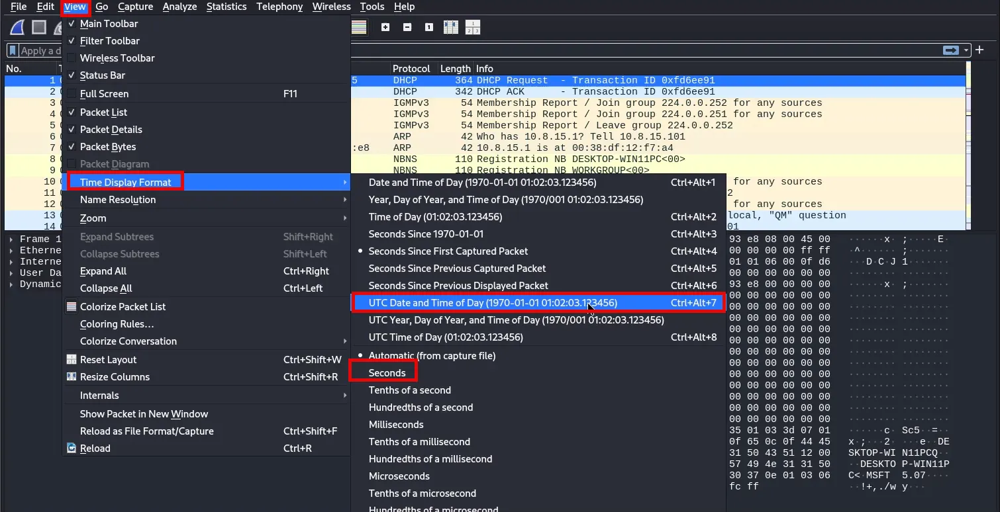
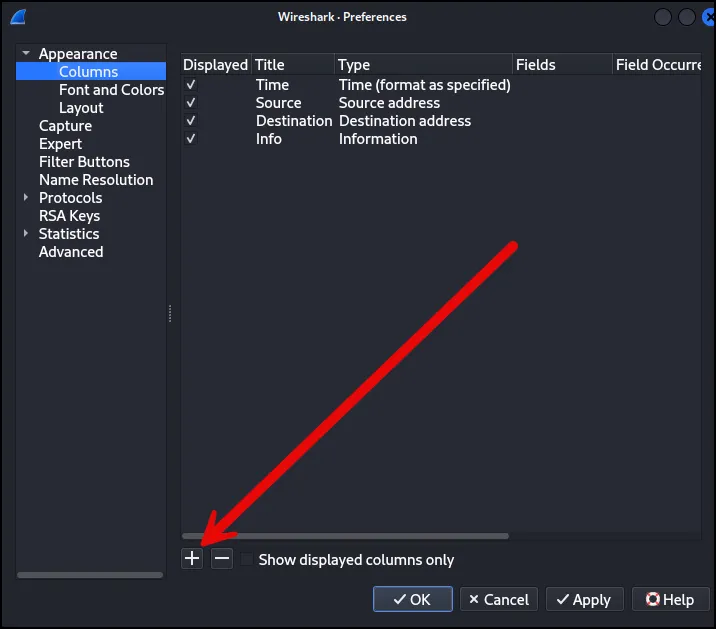
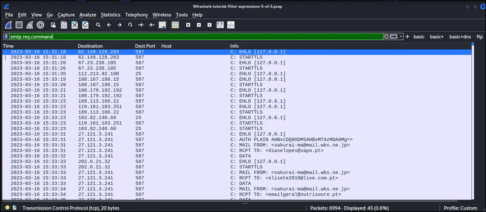

# Wireshark Part 2: Configuring Profiles and Filters

Configuring profiles and filters in Wireshark is a powerful way to streamline and enhance the analysis of network traffic. Profiles and filters allow users to customize their workflow, focus on specific types of traffic, and manage different analysis scenarios efficiently. This walkthrough includes instructions on configuring profiles and filters and demonstrating how they can enhance pcap analysis.

At the end of the walkthrough is a PCAP Exercise. Below is a link to the recording of the session.

## Lab Set Up

It is highly recommended to use a non-Windows environment like Linux or macOS. We will be using pcap files from Windows infections and they may contain malicious binaries that present a risk of infection when using Wireshark on a Windows computer. For this walkthrough, I’m using a Kali Linux VM.  You can use the distro of your choice; however, Wireshark is preinstalled on Kali and it may be easier to standup. 

[Wireshark-tutorial-column-setup.pcap.zip](Files/4-ConfiguringProfile/Wireshark-tutorial-column-setup.pcap.zip)

[Wireshark-tutorial-filter-expressions-5-pcaps.zip](Files/4-ConfiguringProfile/Wireshark-tutorial-filter-expressions-5-pcaps.zip)

Or from directly from Brad’s website. 

[malware-traffic-analysis.net](https://www.malware-traffic-analysis.net/)

### **Profiles in Wireshark**

A **profile** in Wireshark is a set of configurations tailored to a specific analysis context or environment. Profiles store settings such as display filters, color rules, column layouts, and protocol preferences. For example, a network engineer troubleshooting HTTP traffic might create a profile optimized for web analysis, while a security analyst investigating malware might use a profile focused on identifying suspicious behavior.

Profiles can be created, customized, and saved, allowing users to switch between them depending on the task at hand. This feature is particularly useful for professionals working in diverse environments, such as corporate networks, cloud infrastructure, or incident response scenarios. By having predefined profiles, users can avoid manually reconfiguring Wireshark each time they analyze a different type of traffic.

---

### **Filters in Wireshark**

**Filters** are another essential tool in Wireshark, enabling users to narrow down and isolate relevant packets from potentially massive amounts of data. Wireshark provides two types of filters:

1. **Capture Filters**: Applied while capturing traffic to limit the data collected. These filters reduce the volume of data stored and analyzed, improving performance and ensuring only relevant packets are captured. For instance, you can set a capture filter to collect only DNS traffic or packets from a specific IP address.
2. **Display Filters**: Applied to already captured data, allowing users to focus on specific traffic types, protocols, or attributes. For example, a display filter might show only HTTP traffic or packets with a specific source or destination address.

Filters use a powerful syntax to create precise rules. For example:

- `ip.src == 192.168.1.1`: Displays packets originating from the specified IP address.
- `tcp.port == 443`: Shows traffic on port 443 (HTTPS).
- `http`: Isolates HTTP traffic.

These filters make it easy to drill down into specific traffic patterns or identify anomalies within a dataset.

---

### **Advantages of Configuring Profiles and Filters**

1. **Efficiency**: Profiles and filters save time by automating repetitive tasks and focusing analysis on relevant data. Instead of manually setting up filters or interface views for every session, users can rely on preconfigured settings.
2. **Consistency**: Using profiles ensures consistent configurations across different analysis sessions. This is especially important when working on teams or following standard procedures in a SOC (Security Operations Center).
3. **Improved Focus**: Filters help eliminate irrelevant noise from large datasets, allowing analysts to zero in on packets that matter most for their investigation.
4. **Enhanced Visualization**: Profiles can include color-coding and column layouts that make important traffic stand out visually. For instance, suspicious packets might appear in red, while secure traffic is highlighted in green.
5. **Versatility**: Multiple profiles can be created for different use cases, such as performance monitoring, incident response, or protocol-specific analysis. Switching between profiles enables quick adaptation to changing scenarios.
6. **Scalability**: By combining capture filters with profiles, Wireshark can handle large traffic volumes more effectively, reducing resource usage and simplifying the analysis of high-speed networks.

### 

## Create a Profile

Launch Wireshark and navigate to **Configuration Profiles** under the **Edit** menu. Create a duplicate of the default configuration profile by selecting the **Copy** button, as illustrated below.


Once you've copied the default profile, rename it. We recommend naming it "Custom," as demonstrated below.


If the newly created profile remains selected when the Configuration Profiles window is closed, any customizations made to Wireshark will be saved to this profile.

## Web Traffic and the Default Column Layout in Wireshark

Malware is often distributed through web traffic, which can also be used for data exfiltration and command-and-control operations. However, Wireshark's default column settings are not well-suited for analyzing such malicious activities.

Wireshark's column display can be customized to better analyze web traffic. To see Wireshark's default layout, open the pcap file previously downloaded for this tutorial. The default layout for Wireshark version 4.0.7 is displayed below.


Examine your column display. Wireshark’s default columns are listed below.

| **Column Name** | **Column Description** |
| --- | --- |
| No. | Frame number from the beginning of the pcap. The first frame is always 1. |
| Time | Seconds broken down to the microsecond from the first frame of the pcap. The first frame is always 0.000000. |
| Source | Source address, commonly an IPv4, IPv6 or Ethernet address. |
| Destination | Destination address, commonly an IPv4, IPv6 or Ethernet address. |
| Protocol | Protocol used in the Ethernet frame, IP packet or TCP segment (ARP, DNS, TCP, HTTP, etc.). |
| Length | Length of the frame in bytes. |
| Info | Information about the Ethernet frame, IP packet or TCP segment. |

This tutorial customizes Wireshark to use the column layout shown below, optimized for analyzing Windows-based malware traffic.

| **Column Name** | **Column Description** |
| --- | --- |
| Time | Date and time in UTC. |
| Source address | IPv4, IPv6 or Ethernet source address. |
| Source port | TCP or UDP port used by the source address for IPv4 or IPv6 traffic. |
| Destination address | IPv4, IPv6 or Ethernet destination address. |
| Destination port | TCP or UDP port used by the destination address for IPv4 or IPv6 traffic. |
| Domain | Domain name used in HTTP or HTTPS traffic. |
| Info | Information about the Ethernet frame, IP packet or TCP segment. |

To customize the Wireshark column display, we will begin by adjusting the Time column to display the date and time in Coordinated Universal Time (UTC).

## **Changing Date and Time to UTC**

When sharing information about a malware infection publicly, recipients may be located across various time zones. To ensure consistency, UTC is used as the standard format for reporting the time of malicious activity.

To adjust Wireshark's time display format, navigate to the **View** menu, select **Time Display Format**, and change the setting from **Seconds Since Beginning of Capture** to **UTC Date and Time of Day**. Then, use the same menu path to change the resolution to **Seconds** instead of **Automatic**. The menu paths for these options are shown below.



Once completed, the column display will show the UTC date and time as illustrated below. This allows us to immediately identify the date and time of the network traffic when reviewing a pcap.


The next step in customizing Wireshark is to remove columns that are not essential for daily tasks.

## **Removing Columns**

The No., Protocol and Length columns are not necessary when reviewing web-based traffic, so we can remove them. To remove these columns, right-click on the column header and select "Remove this Column" from the menu as shown below.


The **No.**, **Protocol**, and **Length** columns are not essential for analyzing web-based traffic, so they can be removed. To remove a column, right-click on its header and select **Remove This Column** from the menu, as shown below.

After removing the unnecessary columns, we are ready to add new columns to our Wireshark display.


## **Adding Columns**

Columns can be added in Wireshark through the Column Preferences window. To access this window, right-click on any column header and select **Column Preferences…** from the menu, as shown below.


This opens the Column Preferences window, which displays all of Wireshark’s columns, whether visible or hidden. At the bottom-left corner of the window, there are two buttons: one with a plus sign to add columns and another with a minus sign to remove them. Click the plus sign to add a new column, as shown below.



A new entry titled **"New Column"** will appear at the bottom of the list. To rename the column, double-click on the title and enter the desired name, as demonstrated below.


Rename the new column to **"Src port"** and update the column type from **Number** by double-clicking on the column type setting, as shown below.


Click once more to open a scrollable list of column type options. Scroll down and choose **"Src Port (unresolved)"** as the column type, as shown below


Next, create a new column entry, label it “Dst port” and select “Dest port (unresolved)” as the column type as shown below.


When finished, the Column Preferences window should show the two newly created columns as shown below.


To rearrange the columns, drag **Src Port** to position it after the **Source** address and **Dest Port** after the **Destination** address. To do this, left-click on the desired column, hold the mouse button, and drag it to its new position in the list. The screenshot below illustrates moving the **Dst Port** column to a spot immediately following the **Destination** address entry.


After positioning the newly created **Src Port** and **Dst Port** columns, we recommend updating the column type for **Source** address to **"Src addr (unresolved)"** and **Destination** address to **"Dest addr (unresolved)."** If these changes are applied, the Column Preferences window should resemble the screenshot below.


The screenshot below shows an example of what this should look like.

Once these changes are complete, click **OK** to close the Column Preferences window. Wireshark should now display the following six columns, with their corresponding labels and types:

- **Time** - Time (formatted as specified)
- **Src** - Src addr (unresolved)
- **Src port** - Src port (unresolved)
- **Dst** - Dest addr (unresolved)
- **Dst port** - Dest port (unresolved)
- **Info** - Information

The screenshot below illustrates how the updated column layout should appear.


The screenshot above shows that the newly created **Src Port** and **Dst Port** columns are right-aligned, while the other columns are left-aligned. To adjust this, right-click on the header of each right-aligned column to open a menu, then select the **"Align Left"** checkbox to align these columns to the left. The screenshot below demonstrates this adjustment for the **Src Port** column.


Once completed, the **Src Port** and **Dst Port** columns should be left-aligned, consistent with the other columns, as shown below.


Although the Column Preferences window allows us to add various column types, it does not cover every possible option. For instance, it cannot directly add a column to display the domains associated with web traffic. However, we can create a custom column to display these domains.

## **Adding Customized Columns**

Wireshark enables users to create custom columns based on nearly any value available in the frame details window. To improve visibility of the frame details, it’s helpful to temporarily hide the hexadecimal view. To do this, go to the **View** menu and uncheck **"Packet Bytes"**, as shown below.


Now we should only have two sections displaying pcap data: the column display and the frame details.


To start, let's create a custom column for domains associated with unencrypted HTTP web traffic. In Wireshark, enter **http.request** in the filter bar and press **Enter**.

```jsx
http.request
```

Select the first frame in the column display. In the frame details section, expand the **Hypertext Transmission Protocol** line and locate the **Host** field, which should display **msftconnecttest** in this example. Left-click the field to highlight it, then right-click to open a menu and choose **"Apply as Column"**, as shown below


This should create a new column titled Host as shown below.


Next, let's create a custom column for domains associated with encrypted HTTPS web traffic. Clear the Wireshark filter bar, then enter **tls.handshake.type eq 1** and press **Enter**.

```jsx
tls.handshake.type eq 1
```

Select the first frame in your column display.

In the frame details panel, expand the **Transport Layer Security** section. Next, expand **TLSv1.2 Record Layer: Handshake Protocol: Client Hello**. Then, expand the line labeled **Handshake Protocol: Client Hello**.

Scroll further in the frame details section to locate and expand the line labeled **Extension: server_name**. Under that, expand **Server Name: Indication extension**. You will see a line labeled **Server Name: geo.prod.do.dsp.mp.microsoft.com**. Left-click on this line to select it, then right-click to open the menu and choose **Apply as Column**, as shown below.


This should create a new column to the right of our recently created Host column titled “Server Name” as shown below.


Right-click any of the column headers to bring up a menu to reach our Column Preferences window again. In our Column Preferences window, we see these two newly created customized columns as shown below.


To save screen space, we can combine these two columns into a single column. Start by double-clicking the **Fields** value for the **Server Name** entry and copying the text **tls.handshake.extensions_server_name**, as shown below.


Next, use the or operand to combine that text with the Fields value for the Host entry. The new value for the Host entry should read http.host or tls.handshake.extensions_server_name as shown below.


Since both Fields values are now in the Host entry, delete the Server Name entry as shown below.


When finished, the list in your Column Preferences window should appear similar to the screenshot below.


Close the Column Preferences window. You can now filter both HTTP and HTTPS activity, and any associated domains will appear in the updated **Host** column.

Enter the following filter in Wireshark:

```jsx
http.request or tls.handshake.type eq 1
```

Scroll through the results in your updated Wireshark column display. The results should look similar to the Wireshark screenshot below.


Now that we have created all of our columns, we can hide any of them as needed.

## **Hiding Columns**

When analyzing pcaps of web traffic generated by malware, the activity often originates from a single internal IP address belonging to the infected host. For example, this could be a pcap generated by an online malware analysis sandbox. When investigating an alert for a suspected infection, analysts typically examine traffic associated with the internal IP linked to the alert, if such traffic is available.

In these situations, filtering web traffic will display the same internal IP address in the **Src** column. In this tutorial, the pcap was captured from an internal IP address at **10.8.15.101**, so the **Src** column will only show this IP when filtering for web traffic.

To simplify the display and focus on web traffic, you can hide the **Src** and **Src Port** columns. To hide any column in Wireshark, right-click on a column header, then uncheck the boxes for the columns you want to hide. The screenshot below illustrates unchecked boxes for the **Src** and **Src Port** columns.


Hiding these columns offers a clearer view of the web activity. For instance, we can observe that the host generated unencrypted web traffic to the site **httpforever[.]com** on August 7, 2023, at 18:57 UTC, as shown below.


Now that we have customized our column display, we should export our updated configuration profile.

## **Exporting Your Updated Configuration Profile**

Recent versions of Wireshark allow users to export and import personal configuration profiles, which is especially useful when setting up Wireshark in a new environment. Instead of repeating all the steps in this tutorial, you can simply import a previously saved configuration profile.

To export your newly customized configuration profile, navigate to the **Edit** menu and select **Configuration Profiles…**, as shown below.


The Configuration Profiles window should still have our customized profile selected. To export this profile, click on the Export button as shown below. You can export multiple personal profiles you have created.


Exported profile(s) are saved as a ZIP archive. If necessary, ensure your saved filename has a .zip file extension as shown below.


To import a saved profile, click the Import button in your Configuration Profiles window as shown below.


# Part 2: Wireshark Display Filter

In Wireshark's default configuration, the display filter is a bar located immediately above the column display. This is where we type expressions to filter our view of Ethernet frames, IP packets or TCP segments from a pcap. When typing in the display filter bar, Wireshark offers a list of suggestions based on the typed text, as shown below.


If the display filter bar is red, the expression is invalid and will not be accepted. Notice the red color of the filter bar in the screenshot above.

Open the first pcap file named **Wireshark-tutorial-filter-expressions-1-of-5.pcap** in Wireshark. Enter **http.request** into the display filter bar and press **Enter**. If the filter bar turns green, the expression is valid and should function correctly, as shown below.


Wireshark's display filter uses [**Boolean expressions**](https://en.wikipedia.org/wiki/Boolean_expression), so we can specify values and chain them together. The table below lists common Boolean operators used in Wireshark filter expressions.

| **Boolean Operator** | **Expression** | **Alternate Expression** |
| --- | --- | --- |
| Equals | == | eq |
| Not | ! | not |
| And | && | and |
| Or | || | or |

Random examples of Wireshark display filter expressions include:

- ip.addr eq 10.8.15[.]1 and dns.qry.name.len > 36
- http.request && ip.addr == 10.8.15[.]101
- http.request || http.response
- dns.qry.name contains microsoft or icmp

## **Filtering for Web Traffic**

In part 1 we used the following filter for web traffic:

```jsx
http.request or tls.handshake.type eq 1
```

The expression **http.request** displays URLs for HTTP requests, while **tls.handshake.type eq 1** reveals domain names used in HTTPS or SSL/TLS traffic.

For web traffic generated by Windows hosts, this filter may include HTTP requests over UDP port 1900. This traffic corresponds to [**Simple Service Discovery Protocol (SSDP)**](https://en.wikipedia.org/wiki/Simple_Service_Discovery_Protocol), which is used for discovering plug-and-play devices and is not related to typical web traffic. To exclude SSDP traffic from the results, we can modify the filter expression as follows:

```jsx
(http.request or tls.handshake.type eq 1) and !(ssdp)
```

Although parentheses are not mandatory in the above filter expression for Wireshark version 4, we recommend including them to maintain compatibility with older versions of Wireshark. Apply this filter to the first pcap file, **Wireshark-tutorial-filter-expressions-1-of-5.pcap**, and the results should resemble the screenshot below.


Reviewing the traffic shown above reveals several lines of unencrypted HTTP POST requests associated with [**Loki Bot malware**](https://malpedia.caad.fkie.fraunhofer.de/details/win.lokipws) to the URL hxxp://194.55.224[.]9/liuz/five/fre.php, which was [**reported to Threatfox**](https://threatfox.abuse.ch/ioc/1149105/) in August 2023.

To analyze this traffic, click on any line involving communication with **194.55.224[.]9** to select the frame. Then, right-click to open a menu and choose **Follow**, followed by either **TCP Stream** or **HTTP Stream**, as shown below.


A new window will open, displaying an ASCII representation of the content within this unencrypted HTTP traffic. Review this content to familiarize yourself with Loki Bot's command and control (C2) traffic.

Next, open the second pcap file, **Wireshark-tutorial-filter-expressions-2-of-5.pcap**, in Wireshark. This file captures traffic from a [**standard variant IcedID (Bokbot)**](https://www.proofpoint.com/us/blog/threat-insight/fork-ice-new-era-icedid) infection. It includes HTTP traffic to **vrondafarih[.]com** and HTTPS traffic to both **magiketchinn[.]com** and **magizanqomo[.]com**. All three domains were [**identified as IcedID-related in July 2023**](https://threatfox.abuse.ch/browse.php?search=malware%3Aicedid).

The screenshot below highlights these IcedID-associated domains in the second pcap file using Wireshark’s basic web filter.

```jsx
(http.request or tls.handshake.type eq 1) and !(ssdp)
```

The red boxes outline rows of traffic indicating the domains associated with an IcedID infection.


## **Creating Filter Buttons**

Typing complex filter expressions in Wireshark's filter bar each time can be tedious. Fortunately, Wireshark allows you to save any typed expressions as filter buttons for quick access.

On the right side of the Wireshark filter bar, you'll find a **plus sign** to add a filter button. Ensure that the basic web filter used in the previous three screenshots is still active. Once confirmed, click the **plus sign**, as shown below.


Clicking the plus sign generates a temporary panel immediately under the filter bar, as shown above. This panel has three fields: Label, Filter and Comment. The Filter field should contain the expression already implemented in the filter bar. Since this is our basic web filter, type basic in the Label field and click the OK button as shown below.


This should create a button to the right of Wireshark's filter bar labeled "basic" as shown below. Wireshark filter buttons have no borders and look like labels, but they function as buttons. Anytime you need this basic web filter, just left-click on it.


For this walkthrough, we should create the following filter buttons listed below in the table.

| **Button Label** | **Filter Expression** | **Explanation** |
| --- | --- | --- |
| basic | (http.request or tls.handshake.type eq 1) and !(ssdp) | Reveals URLs for HTTP requests, and tls.handshake.type eq 1 shows domain names used in HTTPS or SSL/TLS traffic. Does not show SSDP. |
| basic+ | (http.request or tls.handshake.type eq 1 or (tcp.flags.syn eq 1 and tcp.flags.ack eq 0)) and !(ssdp) | Reveals any TCP connection attempts that failed.  |
| basic+dns | (http.request or tls.handshake.type eq 1 or (tcp.flags.syn eq 1 and tcp.flags.ack eq 0) or dns) and !(ssdp) | Reveals any DNS queries in the pcap. It is very helpful for determining domain names associated with non-web traffic. |

```jsx
(http.request or tls.handshake.type eq 1 or (tcp.flags.syn eq 1 and tcp.flags.ack eq 0)) and !(ssdp)
```

```jsx
(http.request or tls.handshake.type eq 1 or (tcp.flags.syn eq 1 and tcp.flags.ack eq 0) or dns) and !(ssdp)
```

When analyzing suspicious traffic in Wireshark, it’s best to adopt a progressive approach. Start with a simple filter like the basic web filter, then expand your scope by using the **“basic+”** filter to include non-web traffic.

In the table above, the **“basic+”** filter expression displays the same information as the **basic** filter but adds TCP segments with the SYN flag set and the ACK flag not set, using the expression:

`tcp.flags.syn eq 1 and tcp.flags.ack eq 0`

This modification identifies TCP SYN segments, which indicate the start of a TCP stream. Using this filter, you can detect non-web traffic within the pcap, including any failed TCP connection attempts. Repeated failed connection attempts to certain IP addresses could suggest a command-and-control (C2) server that was offline when the pcap was captured.

After reviewing the **“basic+”** filter, move on to the **“basic+dns”** filter to investigate DNS activity.

The **“basic+dns”** filter expression builds on the **“basic+”** filter by including `or dns`, allowing it to capture DNS queries in the pcap. This can help identify domain names linked to non-web traffic. If a malware sample’s C2 server was offline during the capture, this filter might reveal one or more associated C2 domains. Additionally, it could uncover evidence of [**DNS tunneling**](https://www.paloaltonetworks.com/cyberpedia/what-is-dns-tunneling).

Add both the **“basic+”** and **“basic+dns”** filters to Wireshark, as demonstrated in the screenshots below.


After adding the filter buttons, we should see all three to the right of Wireshark’s filter bar as shown below.


With our three newly created filter buttons in place, we can explore other types of malicious traffic.

## **Filtering for Non-Web Traffic**

Open our third pcap **Wireshark-tutorial-filter-expressions-3-of-5.pcap** in Wireshark. This pcap contains post-infection traffic generated by a Remote Access Tool (RAT) malware called [**Ave Maria RAT (also known as Warzone RAT)**](https://malpedia.caad.fkie.fraunhofer.de/details/win.ave_maria).

Using our basic web filter, nothing obvious stands out in the traffic. However, by using our “basic+dns” web filter and scrolling through the results, we can see things more clearly. We can find a DNS query for adaisreal.ddns[.]net that resolves to 87.121.221[.]212, then a TCP segment to that IP address with the SYN flag over TCP port 7888, as shown below.


This is just one example, but different RATs and other types of malware also generate similar types of non-web traffic. Our “basic+dns” filter provides a way to search for malicious non-web activity.

## **Filtering for FTP Traffic**

Some infection traffic uses common protocols that Wireshark can easily decode. Our fourth pcap **Wireshark-tutorial-filter-expressions-4-of-5.pcap** contains post-infection activity caused by a [**malware executable that generates FTP traffic**](https://bazaar.abuse.ch/sample/adfa401cdfaac06df0e529bc9d54b74cea9a28d4266a49edafa5b8e04e3b3594/). Our “basic+dns” filter reveals traffic over TCP port 21 and another TCP port after a DNS query to valvulasthermovalve[.]cl as shown below.


As seen above, we can also see HTTPS traffic to api.ipify[.]org immediately before the FTP activity. While this domain is not inherently malicious, malware often uses the service to check the IP address of an infected host.

Our “basic+dns” filter can help find unencrypted FTP traffic, but other filter expressions would better fit an FTP search. Two basic Wireshark filters for unencrypted FTP traffic are shown below.

| **Filter Expression** | **Description** |
| --- | --- |
| ftp | FTP activity in the control channel (TCP port 21) |
| ftp-data | FTP activity in the data channel (ephemeral TCP port) |

A general-purpose filter expression to review unencrypted FTP activity is:

```jsx
ftp.request.command or (ftp-data and tcp.seq eq 1)
```

Type the above expression into Wireshark’s display filter bar and hit enter. The results should look similar to the screenshot below.


The screenshot above shows the username and password for this compromised FTP site, then a STOR command to send an HTML file to the FTP server. This represents stolen data being exfiltrated from the infected Windows host. We can follow the TCP streams to review the FTP commands and examine the stolen data. If needed, you can save this filter expression as a filter button for future use.

## **Filtering for Email (Spambot) Traffic**

In addition to FTP, malware can use other common protocols for malicious traffic. Spambot malware can turn an infected host into a spambot designed to constantly send email messages. This is characterized by a large amount of DNS requests to various mail servers followed by SMTP traffic on TCP ports 25, 465, 587 and other ports less-commonly associated with SMTP traffic.

Our fifth pcap, **Wireshark-tutorial-filter-expressions-5-of-5.pcap**, contains post-infection spambot traffic. Open that pcap and type the following expression into Wireshark’s filter bar:

```jsx
smtp or dns
```

The results should look similar to the screenshot below.


If you scroll through the results, you should find several DNS queries for various mail server domains and different SMTP statements on the far right under the “Info” column.

Now type the following filter into the filter bar:

```jsx
smtp.req.command
```

The results shown below reveal the infected host contacted several different IP addresses for mail servers in a relatively short amount of time. Note how most of these SMTP requests state STARTTLS, which establishes an encrypted tunnel after the initial SMTP connection. Most email traffic is encrypted, and most spambot activity is also encrypted.



However, spambot traffic might have unencrypted email messages we can review. To find these messages, type the following expression in Wireshark’s filter bar:

```jsx
smtp.data.fragment
```

This should reveal seven results in the column display as shown below. We can follow the TCP stream for any of these to further investigate these messages.


While not extensive, these are the most common filter expressions useful for examining spambot traffic.


## **Conclusion**

Wireshark display filter expressions are essential for interpreting the contents of a pcap file. When paired with an optimized column layout, well-crafted filters can significantly aid security professionals in investigating suspicious network activity.

In the next walkthrough, we will explore how to identify hosts and users while analyzing suspicious network traffic.

# Exercise

The exercise is from the Malware Traffic Analysis website. 

[malware-traffic-analysis.net](https://www.malware-traffic-analysis.net/)

Download the pcap from the link below.

[2024-11-26-traffic-analysis-exercise.pcap.zip](Files/4-ConfiguringProfile/2024-11-26-traffic-analysis-exercise.pcap.zip)

ENVIRONMENT:
• LAN segment range: 10.11.26.0/24 (10.11.26.0 through 10.11.26.255)
• Domain: nemotodes.health
• AD environment name: NEMOTODES
• Domain Controller: 10.11.26.3 - NEMOTODES-DC
• LAN segment gateway: 10.11.26.1
• LAN segment broadcast address: 10.11.26.255
BACKGROUND:
• Alerts on traffic in your network indicate someone has been infected.


TASK:
• Write an incident report based on traffic from the packet capture (pcap) and the
alerts.

Solution can be downloaded from the link below.

[2024-11-26-traffic-analysis-exercise-answers.pdf](Files/4-ConfiguringProfile/2024-11-26-traffic-analysis-exercise-answers.pdf)