# Analyze Network Traffic with Wireshark

Now that we have covered Wireshark basics and configured custom profiles, it's time to apply those skills in a practical analysis using a real-world PCAP file. This file originates from a system involved in malware campaigns, providing valuable insight into malicious activity. The pcap can be downloaded from Malware Traffic Analysis found at the link below. This is the same PCAP file we analyzed using TCPdump.

[Malware-Traffic-Analysis.net - 2024-11-26 - Traffic analysis exercise: Nemotodes](https://malware-traffic-analysis.net/2024/11/26/index.html)

### **Analyzing a Real-World PCAP**

We’ll analyze the file 2024-11-26-traffic-analysis-exercise.pcap, which contains traffic from a host infected with NetSupport RAT, a known remote access Trojan. 

The following alerts for NetSupportRAT were triggered:

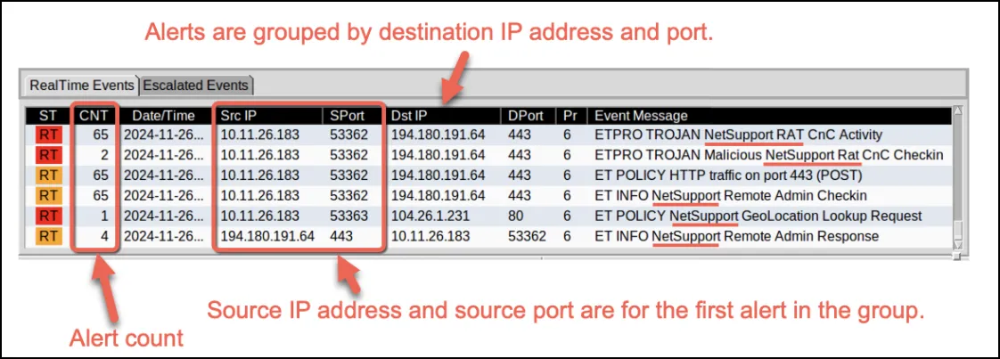

Our analysis will follow a structured approach:

1. Start with a high-level overview to identify interesting patterns or conversations.
2. Narrow the scope to specific IP addresses or protocols.
3. Use filters to uncover Indicators of Compromise (IOCs).

To begin, open the PCAP file in Wireshark:

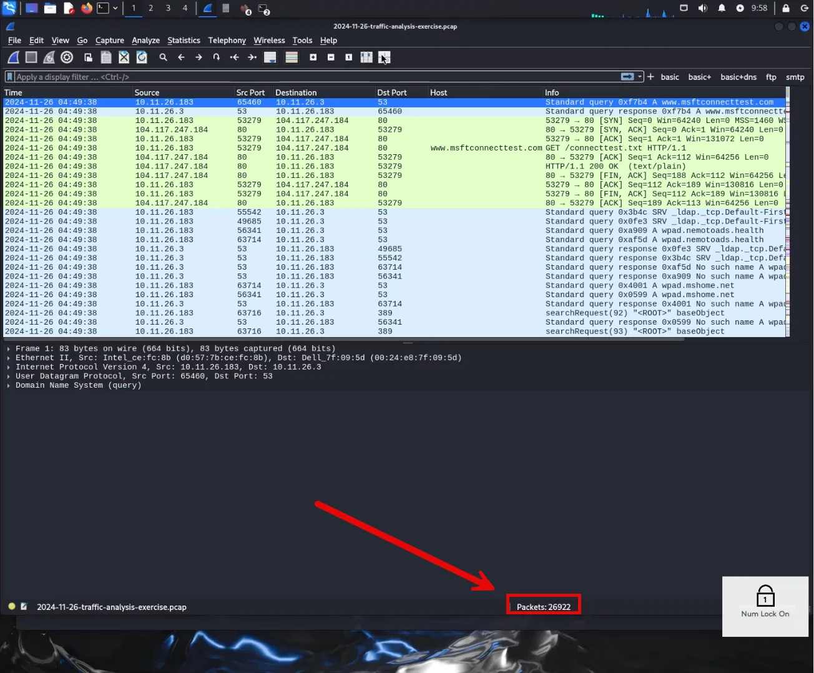

1. **Count Packets**:
As seen above, the number of packets are listed in the status pane.

---

### **Filtering Traffic**

1. By selecting the “basic” filter button we cofigured earlier, we are able to view all successful connections and filter the packets from 2,922 down to 173 packets.

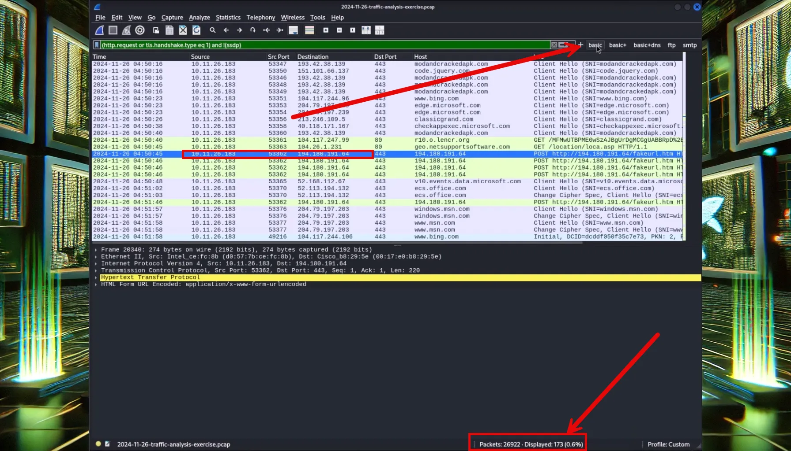

1. Once we have discovered the session with the suspicious IP address that triggered the alert, we can right click that packet and “Follow TCP Stream”.

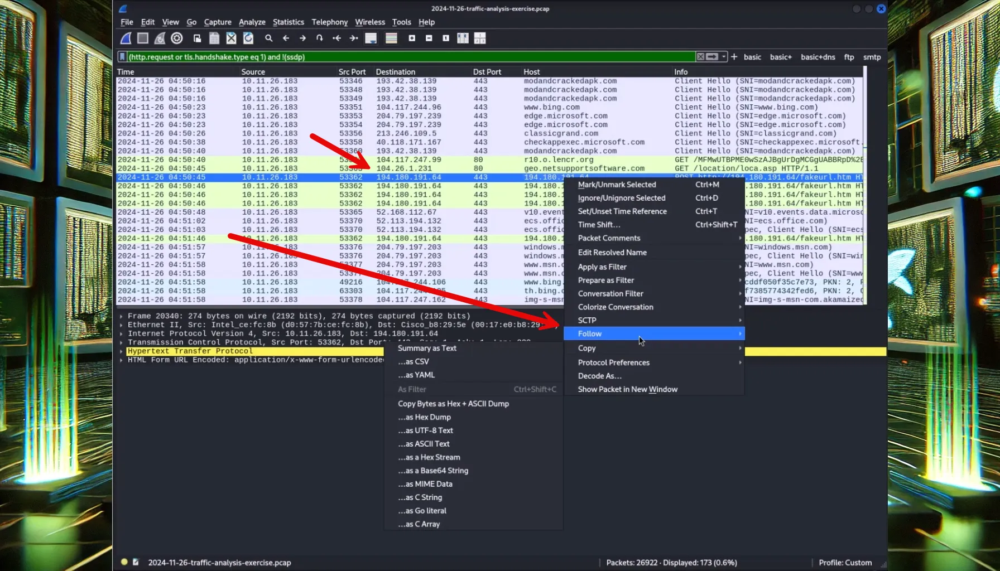

1. By reviewing the header, we discover two interesting entries in the POST request. The first one is the URL 194.180.191.64/fakeurl[.]htm. The second item of interest is the User Agent String, NetSupport Manager.  The NetSupport service is known to be widely abused and used in NetSupportRAT. If your organization does not use this service, this is almost certainly malicious activity.

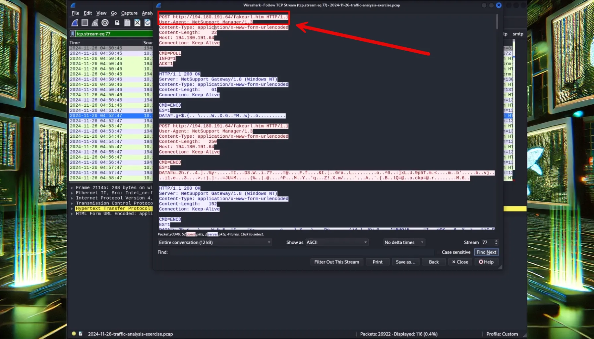

Pivoting to open source research, using VirusTotal, we confirm that 194[.]180[.]191[.]64/fakeurl[.]htm is associated with NetSupportRAT malicous activity.

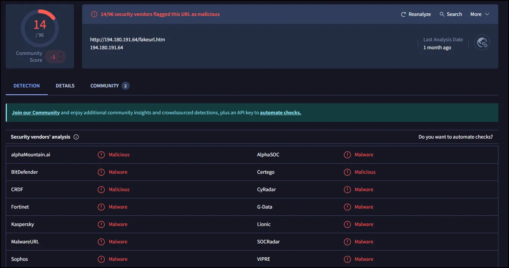

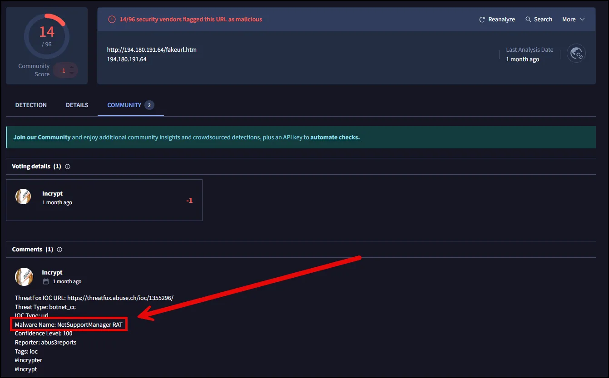

1. We can discover the victim, by running the filter below for LDAP traffic.

```jsx
ldap.AttributeDescription == "givenName”
```

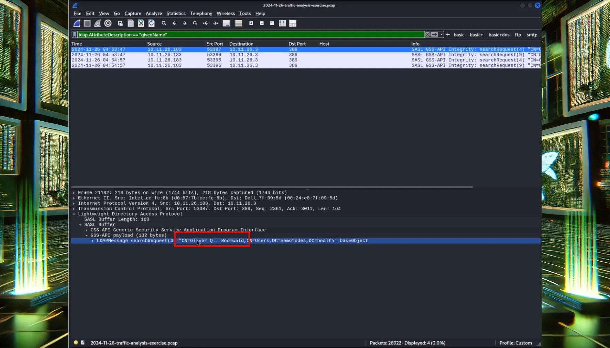

As seen above, the user is Oliver Boomwald.

### Digging Deeper for the Root Cause

1. Using the basic+ DNS filter button, we can see two domains of interest, classicgrande[.]co[m](http://classicgrande.com) and modandcrackedapk[.]com. 

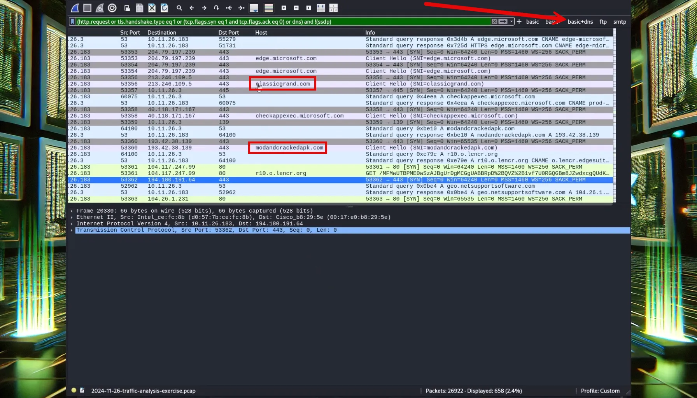

As seen above **classicgrand[.]com** was visited 2024-11-26 23:50:11. The first call out to the C2 was at 2024-11-26 23:50:45, 34 seconds after visiting classicgrand[.]com. 

---

Brad Duncan (owner of Malware Traffic Analysis) visited  [classicgrand](http://classicgrand.com)[.com] shortly after the event and was able to generate an infection from a fake browser update named update.js.

.

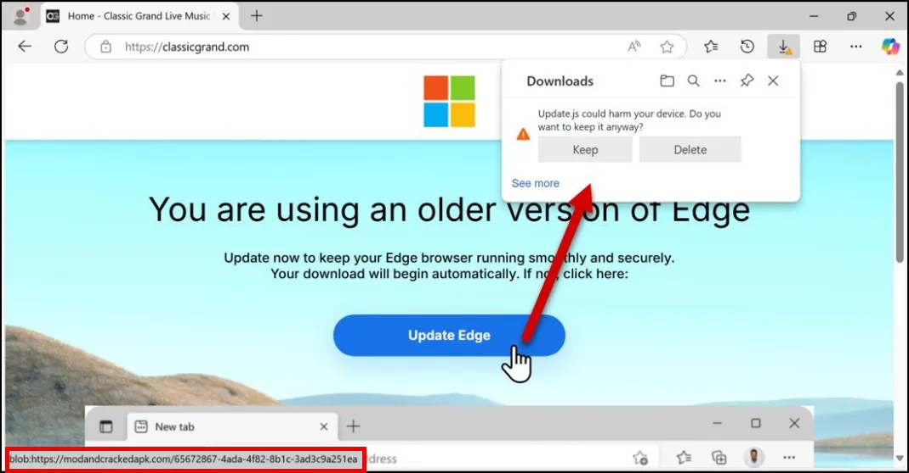

Source: Malware Traffic Analysis

 Note the address for the short cut button “Update Edge” is modandcrackedapk[.]com.

Pivoting back to VirusTotal, we can see that modandcrackedapk[.]com is almost certainly malicious.

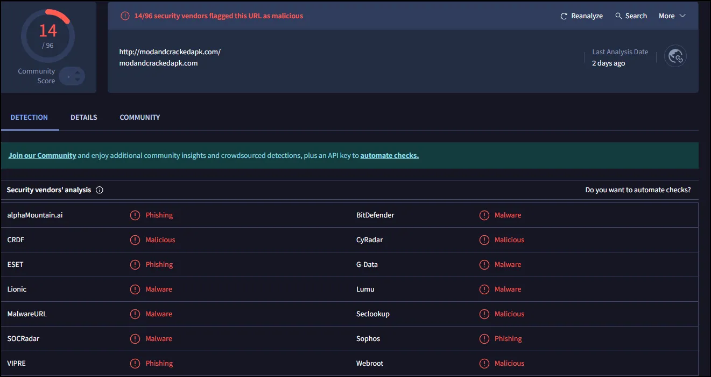

### Conclusion

We have demonstrated that Wireshark can be used to analyze pcap files, as well as capture them. 

If you want to practice more, the Malware Traffic Analysis website has multiple real-world pcap exercises. 

[Malware-Traffic-Analysis.net - training exercises](https://malware-traffic-analysis.net/training-exercises.html)