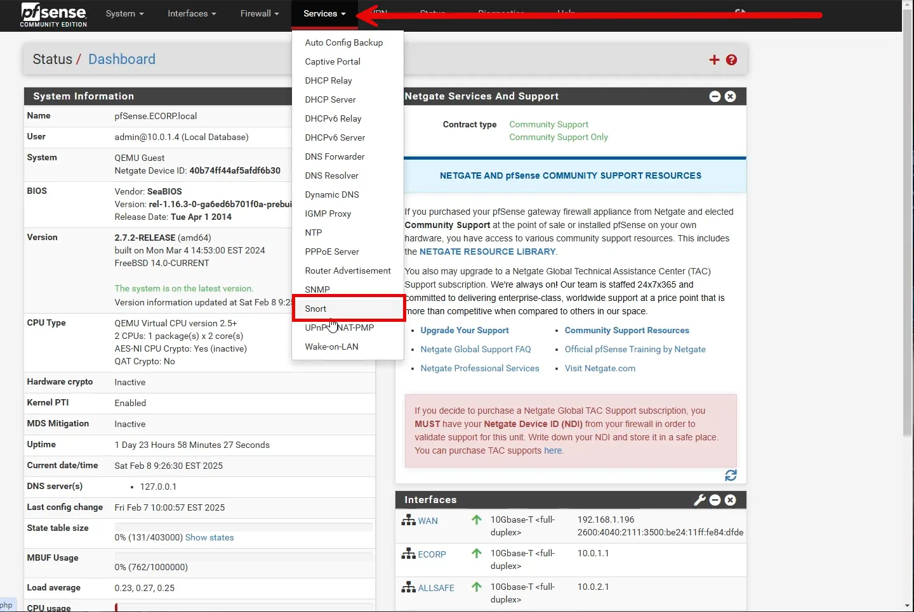
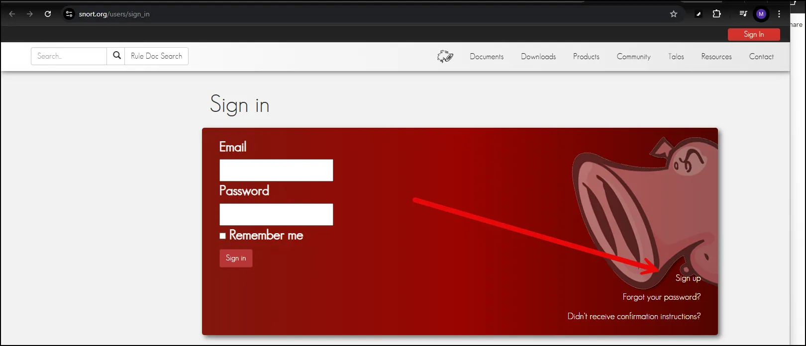
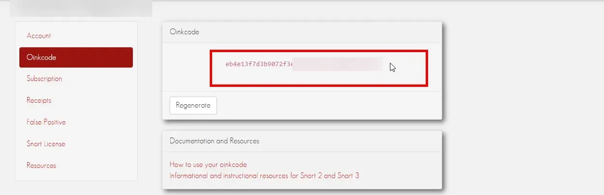
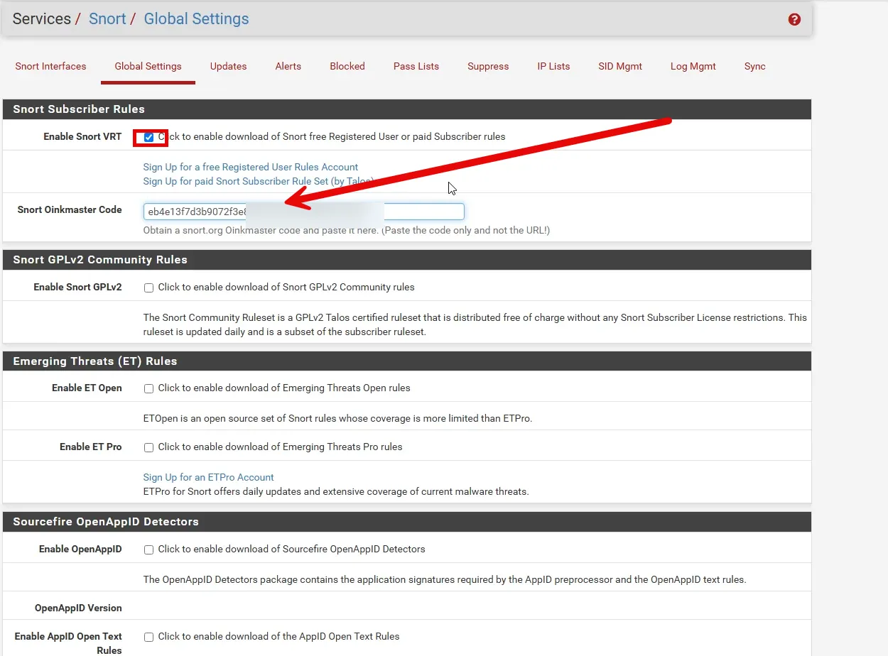
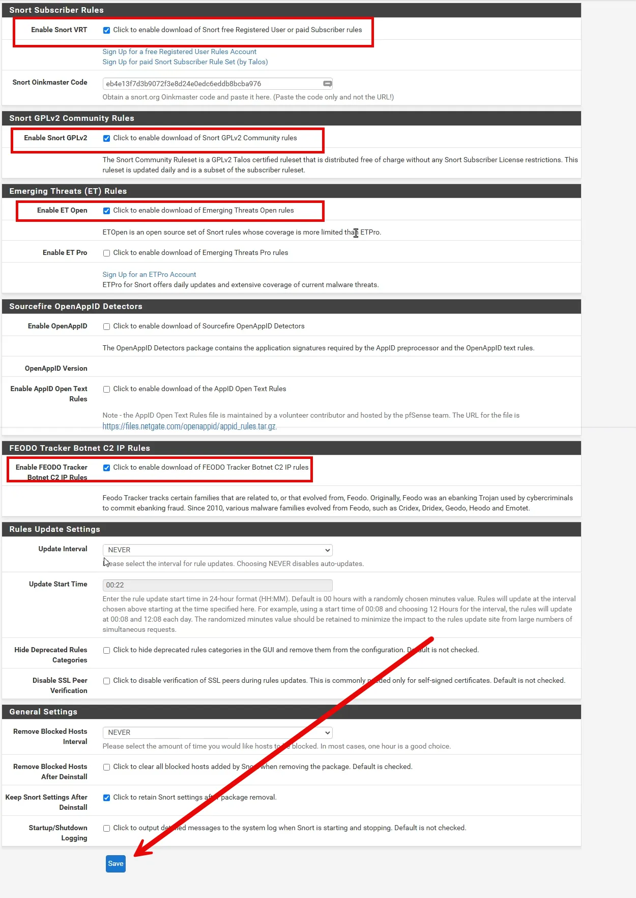
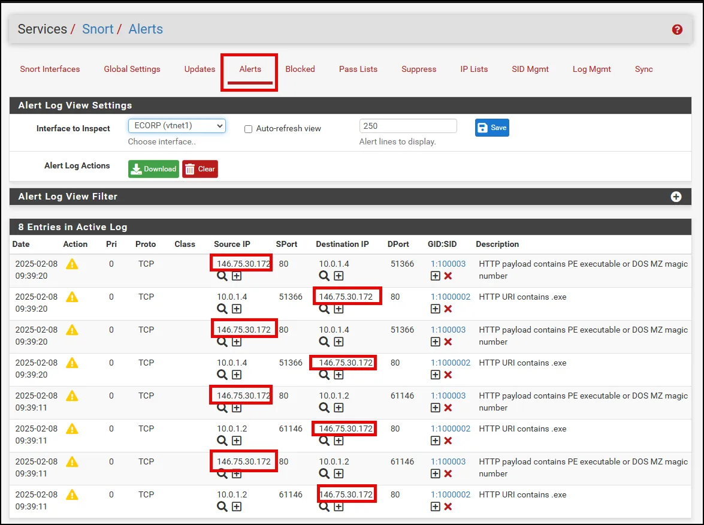

# Snort in pfSense: Pre-Built Rules

In pfSense, Snort leverages **pre-built rule sets** to streamline the detection of threats without requiring users to manually create every rule. These rule sets are maintained by cybersecurity vendors and communities, ensuring up-to-date coverage of known threats, such as malware, exploits, and network scans.

### **How Pre-Built Rules Work**

Pre-built rules are a collection of instructions that define patterns or behaviors associated with suspicious activity. Snort inspects network packets and matches them against these rules. If a match is found, Snort can take various actions, such as logging the event, generating an alert, or blocking the offending traffic.

**Some commonly used free pre-built rule sets in Snort include:**

- Snort VRT
- Snort GPLv2 Community Rules
- Emerging Threats (ET)
- FEODO Tracker Botnet C2 IP Rules

### **Benefits of Pre-Built Rules in pfSense**

1. **Quick Deployment:** Pre-built rules allow you to secure your network without extensive manual configuration.
2. **Threat Intelligence:** Rules are updated regularly to address emerging threats.
3. **Customizability:** You can modify or disable specific rules to tailor Snort's behavior to your network environment.
4. **Automated Protection:** Rules can trigger automated responses to block threats in real time.

### **Setting Up Snort in pfSense**

To configure Snort with pre-built rules in pfSense, follow these steps:

1. Navigate to Snort

1. Navigate to Global Settings

This is where the options for prebuilt rules are located. The first option we will enable is Snort VRT. 

### SNORT VRT

The **Snort VRT (Vulnerability Research Team)** is a dedicated team of security researchers and threat analysts responsible for maintaining and developing high-quality detection rules for **Snort. It is managed by** Cisco Talos.

**Key Responsibilities of Snort VRT:**

1. **Developing and Updating Snort Rules:**
    - The VRT regularly released updated Snort rule sets to detect emerging threats, vulnerabilities, and attack patterns.
    - These rules covered a wide range of threats, including malware, exploits, and reconnaissance activities.
2. **Threat Intelligence Research:**
    - The team analyzed new vulnerabilities, malware, and attack techniques to create accurate detection signatures.
    - They collaborated with other security organizations to stay ahead of evolving threats.
3. **Vulnerability Exploit Coverage:**
    - VRT focused on providing detection rules for known vulnerabilities (CVEs), helping organizations protect their networks from both zero-day and publicly disclosed exploits.
4. **Testing and Quality Assurance:**
    - VRT performed rigorous testing to ensure the reliability and accuracy of the rules they published, minimizing false positives and performance issues.

To use the free registered user rules, we need to create a free account from Snort.org.

Once you have a registered account, you can copy the “Oinkcode” required in the Snort pfSense dashboard to enable the VRT rules. (Note some data is blurred out)

 Paste the oinkcode in the appropriate window.

The second set of rules we will enable are the Snort GPLv2 Community Rules.

### Snort GPLv2 Community Rules

The **Snort GPLv2 Community Rules** are a set of open-source rules for **Snort**, governed by the **GNU General Public License (GPL) version 2**. These rules are freely available to the community and maintained as part of Snort's commitment to open-source security. Unlike proprietary or subscription-based rule sets, the community rules provide basic intrusion detection coverage and are contributed to by both Cisco Talos and the wider Snort community.

The third set of rules we will enable is the Emerging Threat Rules.

### Emerging Threats (ET) Rules

The **Emerging Threats (ET) Rules** are a set of high-quality intrusion detection and prevention rules designed for use with security tools like **Snort** and **Suricata**. Originally developed by the security community, Emerging Threats gained recognition for providing timely, effective rules to detect new and evolving cyber threats. These rules are now maintained and updated by **Proofpoint**, a leading cybersecurity company.

Emerging Threats rules are divided into **ET Open** and **ET Pro** rule sets, offering both free and subscription-based options depending on the needs of the organization. We will use the free rules.

The fourth set of rules we will enable are the FEODO Tracker Botnet C2 IP Rules.

### FEODO Tracker Botnet C2 IP Rules

The **FEODO Tracker** is a project by **Abuse.ch**, designed to track and block botnet **command-and-control (C2)** servers associated with **Feodo**, also known as **Dridex**, **Geodo**, or **Emotet**. This botnet is primarily used to distribute banking trojans, ransomware, and other forms of malware.

To help organizations defend against these threats, the Feodo Tracker provides **C2 IP rules**, which can be integrated into IDS/IPS systems like **Snort** and **Suricata** to block communication between infected hosts and C2 servers. These rules are highly valuable for early detection and prevention of botnet-related activity.

## Testing and Tuning Built In Rules.

As previously discussed, we should never enable any rules or rule set in the production environment without testing them first. With the large number of rules we just enabled, it is very likely there will be some false positives. We can check them by going to the Alerts tab.

Interestingly, the alerts triggered were are Custom Rules we created earlier. A closer examination, shows that they are all related to the same IP address, as shown below.

After doing some quick opensource research, the IP address is registered to Fastly. **Fastly** is a **content delivery network (CDN)**, **edge cloud platform**, and **security provider** that helps websites and applications deliver digital content (such as web pages, images, videos, APIs, and software updates) to users quickly, securely, and efficiently. It is very likely that Fastly was used to import/download the rule sets.    

## **Conclusion: Using Snort's Pre-Built Rules in pfSense**

Integrating **Snort** with **pfSense** enhances network security by providing robust intrusion detection and prevention capabilities. Snort’s **pre-built rules** offer a convenient and powerful way to detect a wide range of threats, including malware, network reconnaissance, exploit attempts, and suspicious traffic. These rules, maintained by experts such as **Cisco Talos** and the **Snort community**, save time by offering predefined detection patterns for known threats.

With **pre-built rules**, administrators can focus on managing alerts and mitigating threats rather than manually creating and maintaining custom rules. Depending on your organization's needs, you can choose between **GPLv2 Community Rules**, **Emerging Threats (ET) Rules**, or subscription-based rule sets for more comprehensive and timely coverage.

In pfSense, Snort's rules are configurable, allowing users to fine-tune them for their specific environments. Administrators can enable or disable rules, modify detection policies, and set alerts to reduce false positives while ensuring critical threats are detected. Combined with pfSense’s firewall and routing capabilities, Snort offers a cost-effective and scalable solution to protect networks against ever-evolving cyber threats.
