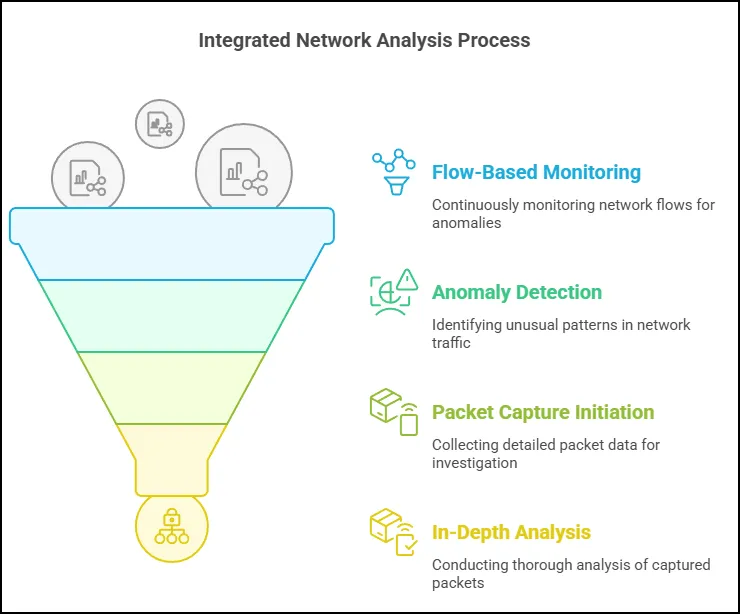

# Introduction to Network Traffic Analysis

Network traffic analysis encompasses various strategies to collect, detect, and analyze data. Two primary approaches for capturing and storing network data are packet-based analysis and flow-based analysis. These approaches often seem to oppose one another but, in reality, complement each other, serving distinct purposes within the broader context of network traffic analysis.

### Packet-Based Analysis

A network packet represents a unit of data transmitted between devices over a network. It includes both the payload (actual data) and control information (metadata) that facilitate routing and management. Packets are akin to pieces of a puzzle, making it possible to transmit information efficiently over a network. For example, when accessing a webpage, data is split into packets that are reassembled upon reaching the client.

Typically, a packet has three components:

1. **Header**: Contains metadata, including source and destination addresses (IP headers) and port numbers (TCP/UDP headers). These are critical for routing and handling packets across the network.
2. **Payload**: The core content of the packet, such as HTML for a webpage, email content, or a file being transferred. Depending on the application, this data may be encrypted for security.
3. **Trailer (if present)**: Some protocols include a trailer for purposes like error detection or padding. For instance, Ethernet frames often include trailers, whereas IP packets do not.

Packet capture involves intercepting and storing these packets for later analysis. Popular methods include:

- **Port Mirroring/Span Ports**: Configuring switches to duplicate traffic for analysis without disrupting the network.
- **Inline Devices**: IDS/IPS systems capture and act on packets based on rules.
- **Network Taps**: Physical devices that passively monitor traffic.

Packet data is usually saved in PCAP (packet capture) files, which store binary data and metadata for detailed analysis. Tools like Wireshark and TCPdump enable the dissection and filtering of PCAP files to identify anomalies or malicious behavior. Full packet capture, while incredibly detailed, requires significant storage and bandwidth and may introduce privacy concerns.

### Flow-Based Analysis

Flow-based analysis, exemplified by protocols like NetFlow, aggregates metadata about network traffic without capturing full packet details. Flow records summarize key details such as source and destination IPs, ports, protocols, timestamps, and durations. This approach resembles a phone bill that logs call details without recording conversations.

NetFlow and similar protocols (e.g., JFlow, SFlow, AppFlow, IPFIX) are generated by network devices like routers and switches. These compact records are more efficient than full packet captures, consuming less storage and bandwidth and enabling longer retention. Tools like SiLK (System for Internet-Level Knowledge) facilitate the collection, filtering, and analysis of flow data.

However, flow records lack the granularity of full packet captures, as they do not include payload data. While flow records provide a macroscopic view of traffic, they are insufficient for detailed investigations requiring payload inspection.

### Complementary Approaches

Rather than choosing between packet-based and flow-based analysis, organizations should use both approaches in tandem. Flow-based analysis excels at continuous monitoring and anomaly detection, particularly at the network edge. When anomalies are identified, full packet captures provide the depth necessary for thorough investigations.

For example, flow data may reveal suspicious traffic patterns, prompting analysts to collect corresponding packets for in-depth inspection. Packet captures are especially valuable when investigating specific systems or segments where granular detail is crucial.
